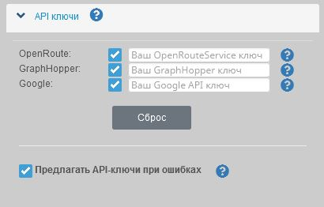
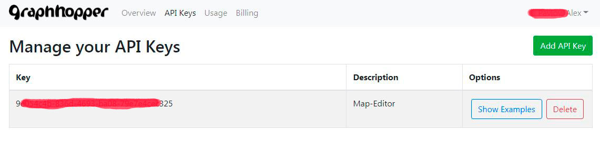
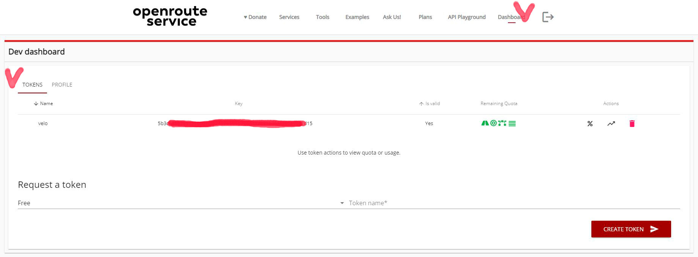

<!-- markdownlint-disable-next-line first-line-heading -->
### Общая информация

Редактор треков является бесплатным для всех пользователей.  
Однако, для использования некоторых сторонних сервисов (маршрутизация, панорамы и пр.) требуется аутентификация и имеются установленные квоты на бесплатное использование.  
При большом кол-ве запросов от пользователей к данным сервисам, возможно достижения лимита, в связи с чем эти сервисы будут возвращать отказ.  
Чтобы обойти ограничения квот, можно установить собственные ключи доступа к этим сервисам.  

На данный момент Редактор использует [собственный сервер высот](/tools/elevation.md), в котором **нет квот и ограничений**.  
Для получения высот используется [Mapzen Terrain Tiles](https://github.com/tilezen/joerd/blob/master/docs/data-sources.md).  В данной модели предоставлены различные данные высот ( [SRTM](https://www.opentopodata.org/datasets/srtm/), [ETOPO1](https://www.opentopodata.org/datasets/etopo1/) и т.д. ), которые выбираются автоматически, тем самым обеспечивая максимальную точность в определенных точках.  
Если Вас не устраивают эти данные (или их точность), Вы можете подключить интересующий Вас сервис из списка ниже, получив собственные ключи.  

**TODO**  В ближайшее время планируется также запустить собственный сервер маршрутизации.

> По умолчанию в редакторе используются:
>  
> - для получения высот: [внутренний сервер высот](/tools/elevation.md) / нет ограничений.
> - для маршрутизации: **API GraphHopper** / есть ограничения по запросам в сутки (см.ниже).

### Добавление ключей

Для добавления и использования собственных API-ключей перейдите в меню :fas fa-cog: `Настройки`  :fas fa-chevron-right: `API ключи`:

Добавленные ключи можно включать/отключать для использования, установив соответствующий флажок.

### Graphhooper

?> GraphHopper — это библиотека и сервер маршрутизации предоставляющие веб-интерфейс под названием GraphHopper Maps, а также API-интерфейс маршрутизации через HTTP.  
По умолчанию используются данные [OpenStreetMap](https://ru.wikipedia.org/wiki/OpenStreetMap) для дорожной сети и данные о высоте от [Shuttle Radar Topography Mission (SRTM)](https://ru.wikipedia.org/wiki/Shuttle_Radar_Topography_Mission).

> В редакторе ключ используется для маршрутизации - прокладки маршрутов вдоль дорог карты.

**Получить ключ API GraphHopper:**

- Перейдите на сайт [GraphHopper](https://graphhopper.com/).
- Пройдите регистрацию, после авторизации перейдите в раздел API-Keys и создайте свой ключ:  

Бесплатный лимит ограничен 500 запросами в день.  
[Стоимость и лимиты](https://www.graphhopper.com/pricing/) для других тарифных планов.

-----

### OpenRouteService

?>[OpenRouteService](https://openrouteservice.org/) (сокращенно ORS) - это сервис маршрутов для автомобилей, пешеходов и велосипедистов на основе открытых стандартов и открытых геоданных. Доступны несколько сервисов на основе местоположения (LBS), созданных на основе данных OSM, разработанных HeiGIT — Гейдельбергским институтом геоинформационных технологий.

> В редакторе ключ от данного сервиса используется для:
>  
> - вычисления точки (маркера) и высот трека;
> - маршрутизации, которая прокладывает треки вдоль дорог карты.

**Получить ключ API OpenRoute Service**

- перейдите на сайт [OpenRoute Service](https://openrouteservice.org/plans/);
- пройдите регистрацию;
- после авторизации перейдите в раздел *"Dashboards"* вкладка *"Tokens"*;
- создайте запрос *"Request a token"*:  
  выберете тип *"Free"* (единственный возможный), укажите *название* для своего токена
  Создайте токен *"CREATE TOKEN"*
  
После создания токена Вам будет доступна таблица, в которой можно скопировать свой ключ, а также просматривать статистику и квоты использования.

Стандартный план (бесплатный) имеет следующие квоты (в день/в минуту):

| Запрос к сервису      | в сутки | в минуту
| --------------------- | :-----: | :-----: |
| Получение высот точек |  2.000  | 100
| Получение высот линий |  200    | 40
| Маршрутизация         |  2.000  | 40

-----

### Google API

!> Внимание! Использование сервисов Google является **платным**.

> В редакторе ключ от данного сервиса используется для:
>  
> - получения высот точек трека и маркеров от сервиса "Google Elevation";
> - отображения панорам "Google Street View".

Как создать ключ: [Руководство](https://developers.google.com/maps/documentation/elevation/get-api-key#before-you-begin)  
Получить ключ API: [Google Developers Console](https://console.developers.google.com/apis).

Или воспользуйтеь [другими руководствами](https://www.google.com/search?q=%D0%BA%D0%B0%D0%BA+%D0%BF%D0%BE%D0%BB%D1%83%D1%87%D0%B8%D1%82%D1%8C+%D0%BA%D0%BB%D1%8E%D1%87+api+%D0%B4%D0%BB%D1%8F+google+maps&oq=%D0%9A%D0%B0%D0%BA+%D0%BF%D0%BE%D0%BB%D1%83%D1%87%D0%B8%D1%82%D1%8C+%D0%BA%D0%BB%D1%8E%D1%87+API+&aqs=chrome.2.69i57j0i512l3j0i22i30l2.13551j1j4&sourceid=chrome&ie=UTF-8)

Cтоимость запроса высот: [Google API Elevation](https://developers.google.com/maps/documentation/elevation/usage-and-billing#pricing-for-product)  
Cтоимость динамических панорам: [Google API Street View](https://developers.google.com/maps/billing/gmp-billing#dynamic-street-view)

-----

### Конфиденциальность

!> **Не сохраняйте ключи локально**, если пользуетесь общим/общедоступным устройством.
Как отключить локальное хранилище: [Сохранение-настроек](/main-config?id=Сохранение-настроек)
