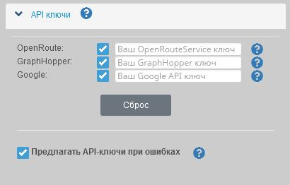
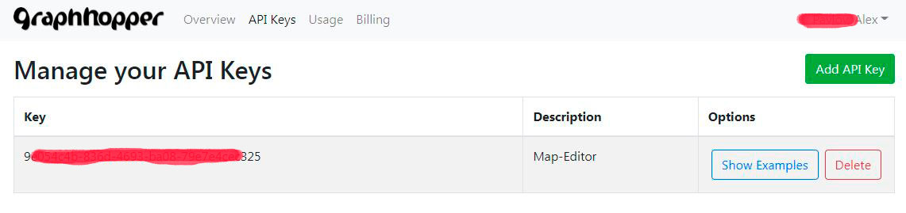
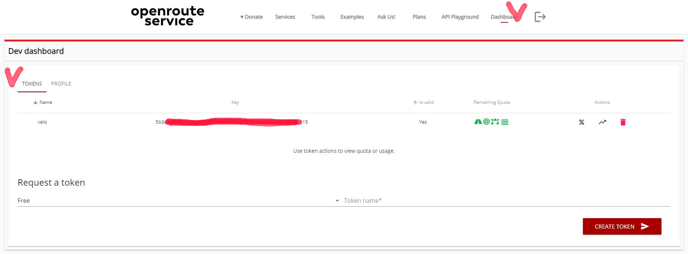

<!-- markdownlint-disable-next-line first-line-heading -->
### General information

The track editor is free for all users.  
However, to use some third-party services (routing, panoramas, etc.), authentication is required and there are established quotas for free use.  
With a large number of requests from users to these services, it is possible to reach the limit, and therefore these services will return a refusal.  
To circumvent quota restrictions, you can set your own access keys to these services.  

At the moment, the Editor uses its [own elevation server](/en/tools/elevation.md), in which **there are no quotas and restrictions**.  
To get heights, use [Mapzen Terrain Tiles](https://github.com/tilezen/joerd/blob/master/docs/data-sources.md ). Various elevation data are provided in this model ([SRTM](https://www.opentopodata.org/datasets/srtm/), [ETOPO1](https://www.opentopodata.org/datasets/etopo1/), etc.), which are selected automatically, thereby ensuring maximum accuracy at certain points.  
If you are not satisfied with this data (or its accuracy), you can connect the service you are interested in from the list below by getting your own keys.  

> By default, the editor uses:
>
> - to get heights: [internal elevation server](/en/tools/elevation.md) / there are no restrictions.
> - for routing: **GraphHopper API** / there are restrictions on requests per day (see below).

> [!NOTE]
> It is also planned to launch its own routing server in the near future.

### Adding Keys

To add and use your own API keys, go to the menu :fas fa-cog: `Settings`  :fas fa-chevron-right: `API keys`:

The added keys can be enabled/disabled for use by checking the appropriate checkbox.

### Graphhooper

?> GraphHopper is a routing library and server that provides a web interface called GraphHopper Maps, as well as a routing API via HTTP.  
By default, [OpenStreetMap](https://ru.wikipedia.org/wiki/OpenStreetMap) data is used for the road network and altitude data from [Shuttle Radar Topography Mission (SRTM)](https://ru.wikipedia.org/wiki/Shuttle_Radar_Topography_Mission).

> In the editor, the key is used for routing - laying routes along the roads of the map.

**Get the GraphHopper API key:**

- Go to the website [GraphHopper](https://graphhopper.com/).
- Register, after authorization, go to the API-Keys section and create your key:  

The free limit is limited to 500 requests per day.  
[Cost and Limits](https://www.graphhopper.com/pricing/) for other tariff plans.

-----

### OpenRouteService

?>[OpenRouteService](https://openrouteservice.org/) (abbreviated ORS) is a service of routes for cars, pedestrians and cyclists based on open standards and open geodata. Several location-based services (LBS) based on OSM data developed by HeiGIT - Heidelberg Institute of Geoinformation Technologies are available.

> In the editor, the key from this service is used to:
>  
> - calculations of the point (marker) and track heights;
> - routing that lays tracks along the roads of the map.

**Get the OpenRoute Service API key**

- go to the website [OpenRoute Service](https://openrouteservice.org/plans/);
- complete the registration;
- after authorization, go to the *"Dashboards"* tab *"Tokens"*;
- create a request *"Request a token"*:  
  select the type *"Free"* (the only possible one), specify the *name* for your token  
  Create a token *"CREATE TOKEN"*  
  
  After creating the token, you will have access to a table where you can copy your key, as well as view statistics and usage quotas.

The standard plan (free) has the following quotas (per day/per minute):

| Service request | per day | per minute
| --------------------- | :-----: | :-----: |
| Getting point heights | 2.000 | 100
| Getting line heights | 200 | 40
| Routing | 2.000 | 40

-----

### Google API

!> Attention! The use of Google services is **paid**.

> In the editor, the key from this service is used to:
>
> - getting track point heights and markers from the Google Elevation service;
> - displays panoramas "Google Street View".

How to create a key: [Руководство](https://developers.google.com/maps/documentation/elevation/get-api-key#before-you-begin)  
Get the API key: [Google Developers Console](https://console.developers.google.com/apis ).

Or use [others руководствами](https://www.google.com/search?q=%D0%BA%D0%B0%D0%BA+%D0%BF%D0%BE%D0%BB%D1%83%D1%87%D0%B8%D1%82%D1%8C+%D0%BA%D0%BB%D1%8E%D1%87+api+%D0%B4%D0%BB%D1%8F+google+maps&oq=%D0%9A%D0%B0%D0%BA+%D0%BF%D0%BE%D0%BB%D1%83%D1%87%D0%B8%D1%82%D1%8C+%D0%BA%D0%BB%D1%8E%D1%87+API+&aqs=chrome.2.69i57j0i512l3j0i22i30l2.13551j1j4&sourceid=chrome&ie=UTF-8)

The cost of requesting heights: [Google API Elevation](https://developers.google.com/maps/documentation/elevation/usage-and-billing#pricing-for-product)  
Cost of dynamic panoramas: [Google API Street View](https://developers.google.com/maps/billing/gmp-billing#dynamic-street-view )

-----

### Privacy

!> **Do not store keys locally** if you use a shared/public device.
How to disable local storage: [Save-settings](/en/main-config?id=Saving-settings)
