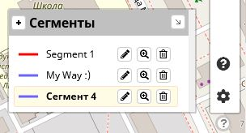
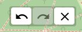
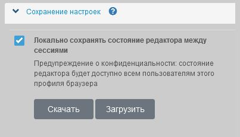

<!-- markdownlint-disable-next-line first-line-heading -->
Go to the section :fas fa-cog:`Settings` :fas fa-angle-right:`Editing Settings`

?>If the local [save settings](/en/main-config.md?id=Saving-settings), all the following settings of the current session will be automatically applied when you next log in to the editor in this browser, otherwise the default settings will be applied (as shown in the picture).

### Maximum number of track points on the screen

In track editing mode, with a large number of editable points, the editor may slow down. In order to avoid this, the default value is 500 editable points. Thus, if there is more than the specified number on the screen, the editor will switch to viewing mode and offer to zoom in on the track to reduce the number of editable points. As soon as the number of points is less than the specified value, the editor will switch back to track editing mode.  
You can adjust this parameter depending on the performance of your browser by setting the maximum number of track points on the screen at which editing is possible.  
To cancel the restrictions, set 0 (not recommended).

### Delete points Ctrl+Click

If set, it allows you to delete the points of the edited track with the combination of 'Ctrl + Left click' of the mouse.

### Display a Legend

If set, the Legend (list of segments) is displayed on the map.
It will be displayed in the lower right corner of the map as a button or list, depending on the saved state of the editor.
You can also use the `L' shortcut key to display/hide the Legend.

The legend allows you to get quick access to adding, editing the name and description, viewing, deleting segments, and also allows you to set [custom segment color](/en/tracks/track-config.md?id=Custom-color-segments) of the track.  

|Legend|
|:---:|
|

### Display zoom buttons

If set, the zoom buttons `+` and `-` will be displayed on the map.  
To scale the map (zoom in/out), hotkeys are available `+` / `-` (on the numeric keypad) or `+` / `Shift+` (on the main keyboard)

### Display the forward/backward buttons

In the editor, the ability to cancel/return an action is available. Intermediate data is stored in the browser's local storage and the number of steps forward and backward can be changed by the administrator depending on the version of the editor. This version has 10 steps installed.  
The data can be cleared with the [X] button.  
If selected, a block with buttons will be displayed in the lower right corner of the map.

!> Cancel/Returns are only available in the current session.  
When exiting the editor, the data **is not saved!**

### Pop-up notifications

If selected, pop-up messages about editor actions will be displayed (recommended).
>[!NOTE]
>Error messages will be displayed even if this option is not selected.

### Unit of length

Allows you to change the editor settings between imperial (miles) and metric (meters) units of length.

### Saving settings

Go to the section :fas fa-cog: `Settings`  :fas fa-chevron-right: `Saving settings`

By default, the status of the track editor will be permanently stored in your browser's local storage, so when you close and reopen it in this browser, it will restore the same content and settings.

If necessary, you can download all the editor settings as a file and then download them and apply them in any other.  
To do this, use the `Download` and `Download' buttons.

!> **Privacy Warning:** the editor status will be available to all users of this browser profile.  
If you are using a shared/shared device, disable this feature. After disconnecting, all data will be deleted from the browser's local storage.