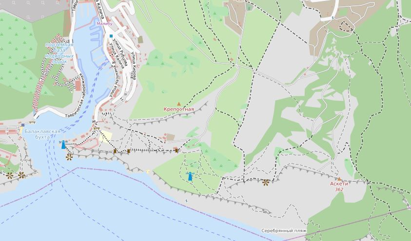
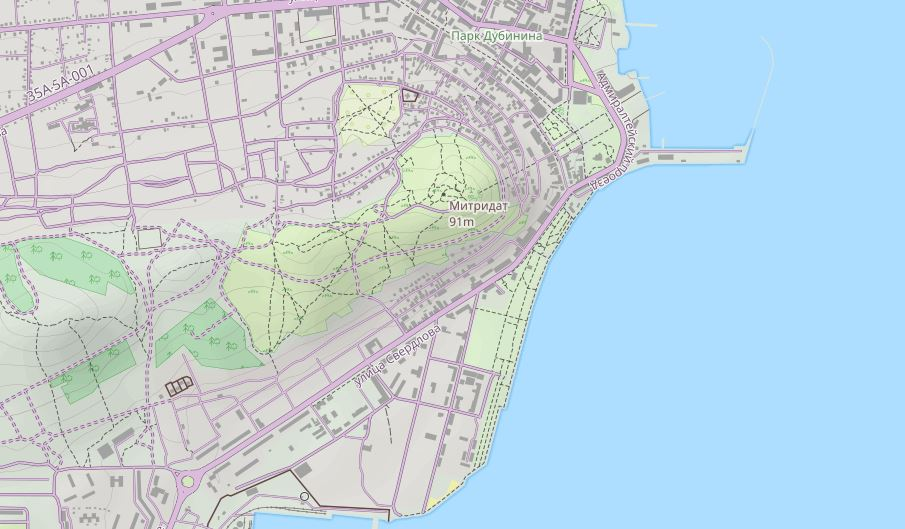
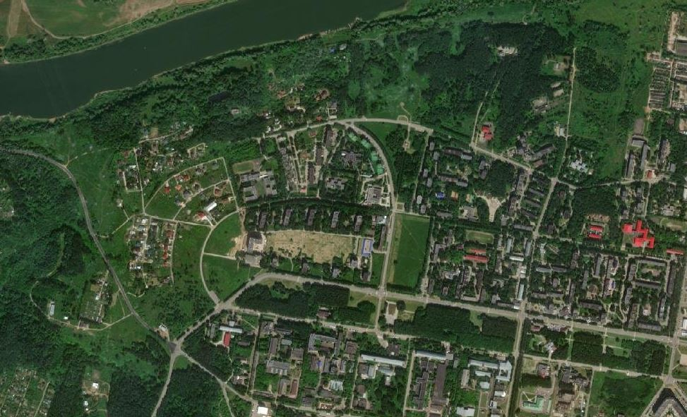
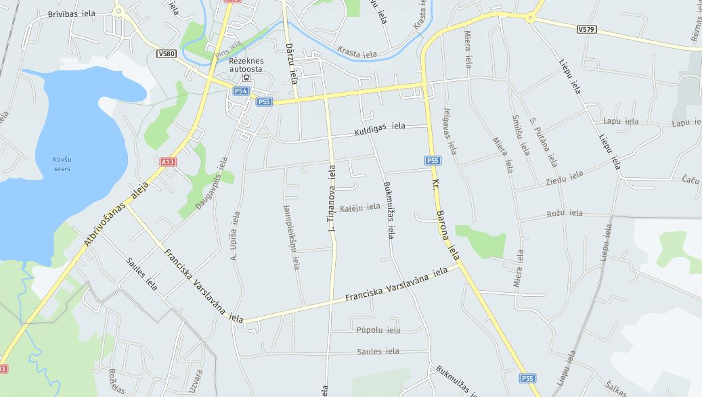
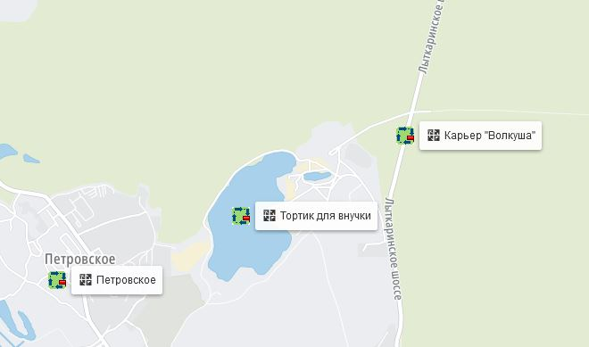

<!-- markdownlint-disable-next-line first-line-heading -->
### Display Settings

To configure, select the item :fas fa-cog: `Map configuration` in the drop-down list of maps/layers:

|    |
|:--:|
|

In the list that opens, you can:

- hide :fa fa-eye: unused layers/maps;
- determine the order of their sorting in the menu by: fa fa-hand pointer: dragging blocks with card names

|    |
|:--:|
|

The Reset button will return the default settings.  
The purpose of the other buttons is described in the section [personal maps](/en/maps/maps-personal.md)

>[!NOTE]
> The sorting will be saved automatically after closing the settings window.
> If saving to Local Storage is set, the sorting order will be displayed in this form at subsequent logins in the browser in which these settings were made.

>[!ADVICE]
> Local editor settings can be [exported](/en/main-config?id=Saving-settings) to a file for later use in other browsers or devices.

### List of maps

#### pre-installed maps

| map type | preview
| --- | :---: |
|OpenStreetMap|
|OpenStreetMap H.O.T.|
|OpenTopoMap|
|CyclOSM|
|OpenCycleMap|
|MtbMap|
|Bicycle for hiking|
|Yandex map|
|Yandex map + Traffic|
|Yandex Satellite|
|Yandex Hybrid|
|Outdoors|
|Transport|
|Landscape|
|MapBox|
|MapBox Street|
|TomTom|
|Esri WorldStreetMap|
|Esri WorldMap|
|Esri WorldImagery|
|Esri WorldGrayCanvas|
|HERE|
|HERE satellite|
|HERE hybrid|
|Google Roadmap|

#### pre-installed overlay

|layer type | preview
| --------- | :----: |
|Geocaching|
|HikeBike.HillShading|
|OpenRailwayMap|
