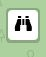
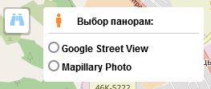
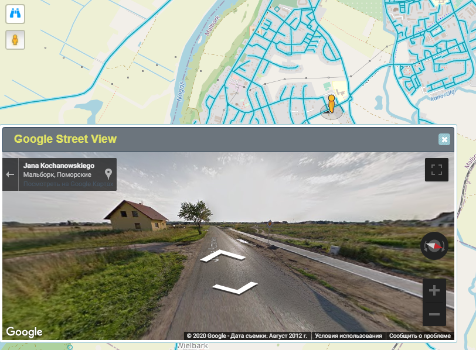
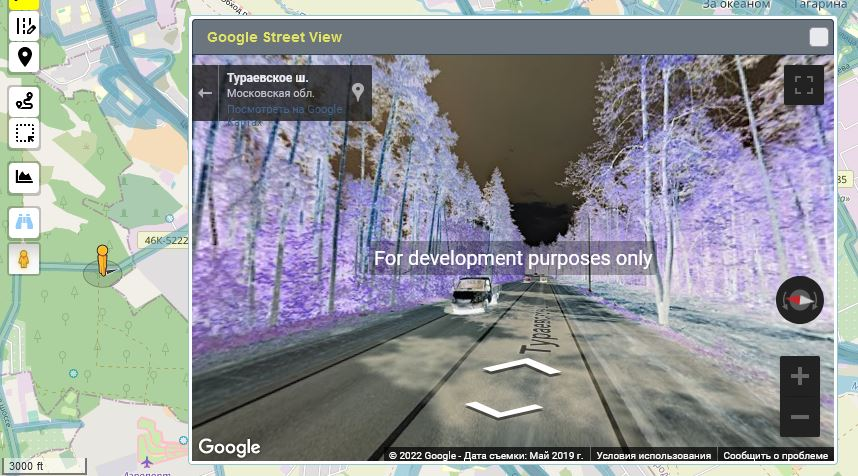
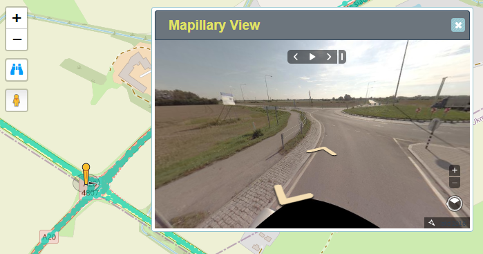

<!-- markdownlint-disable-next-line first-line-heading -->
!> This section is under development! [TODO](../en/todo.md )

1. Turn on the panorama view mode  
   

1. In the window that opens, select the panorama view  
   

1. Drag the "Pegman" that appears to the point on the map where you want to start the review  
   

1. The panorama window can be dragged across the screen and resized.

1. Move the "Pegman" on the map or use the navigation buttons in the viewport to change the panorama overview

1. To exit the panorama viewing mode, close the viewing window and click on the panoramas button again to disable their overlay on the map.  
   About the enabled state of the panorama mode is symbolized by the blue color of the icon :fa fa-binoculars:

### Google-panoramas

!> To view Google panoramas, an API key is required

|with API key|without API key
|:---:|:---:|
||

### Mapillary

>[!DANGER]
>MAPILLARY panoramas are currently disabled, until a solution to the problem of requests to their servers is found.  
>The problem arose due to the update of the API-Mapillary to version 4 implemented by the developers :sad:

**Appearance of Mapillary panoramas:**  

