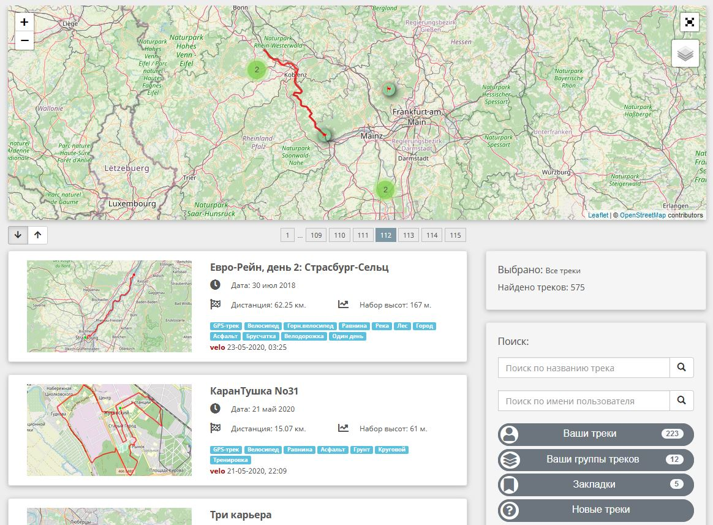
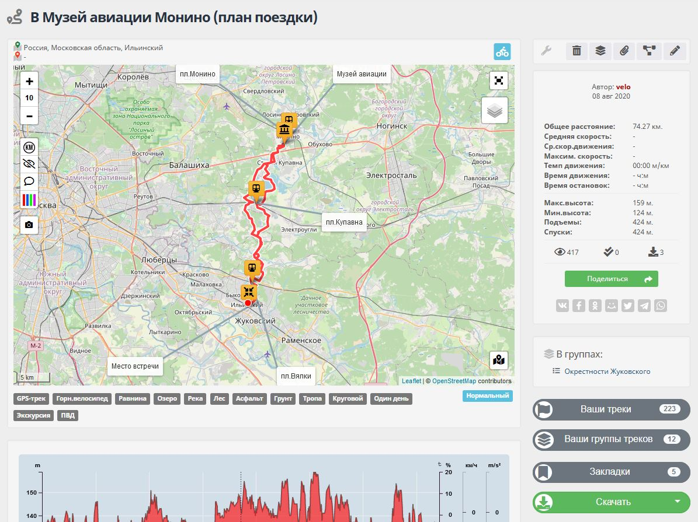
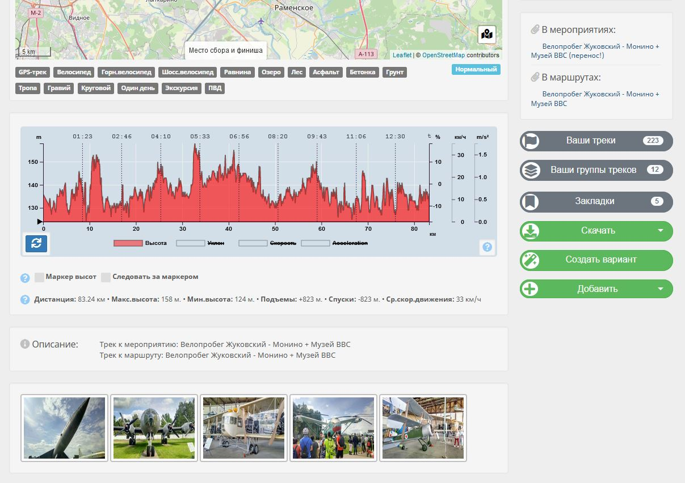
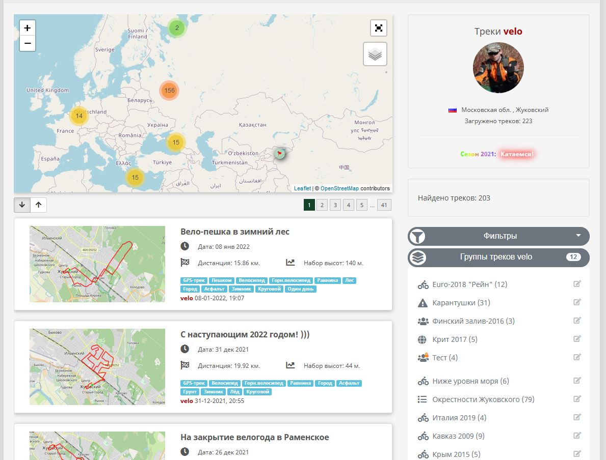
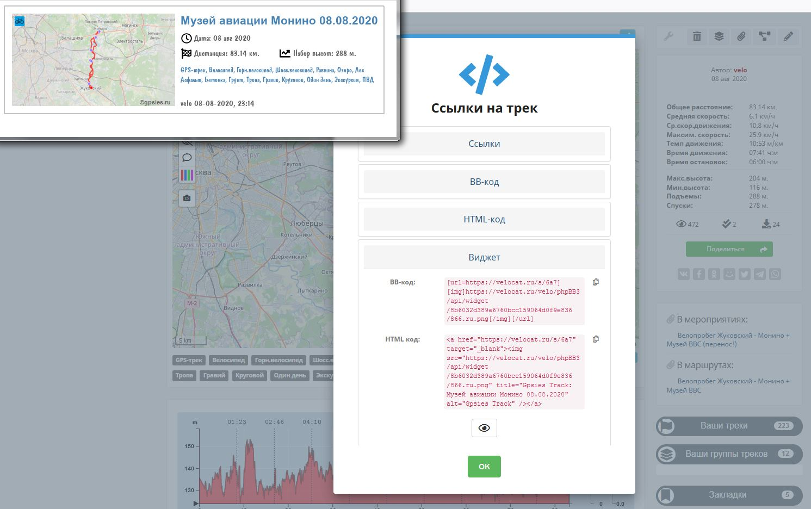
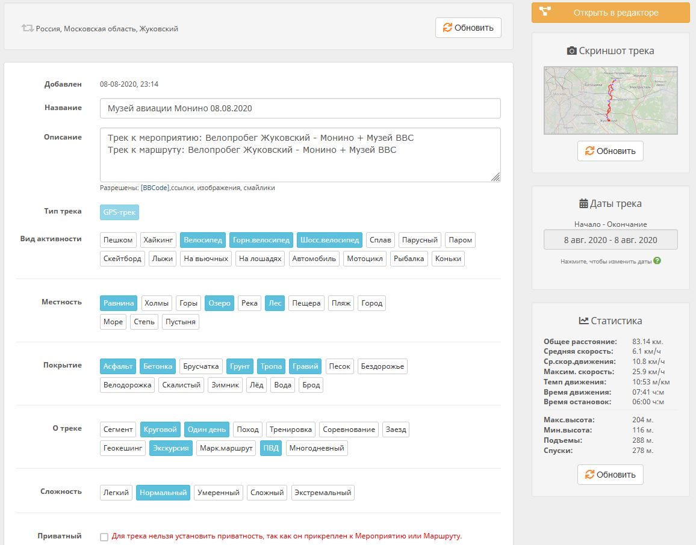
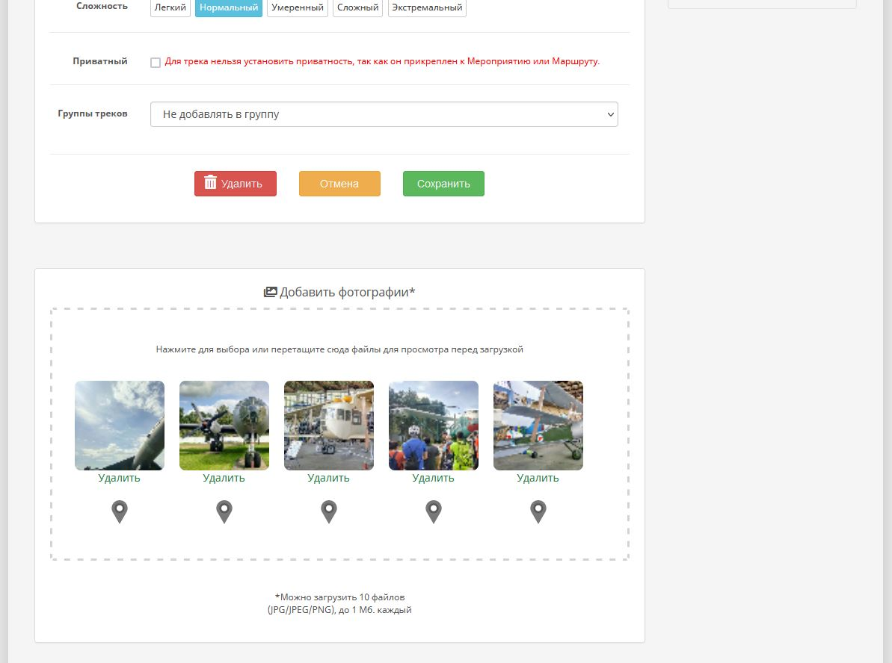

### General information

This editor is an integral part of the [Track Repository GPSies.ru ](https://velocat.ru/velo/phpBB3/map.php )

>GPSies features:
>
> - upload tracks (locally or by link);
> - receive and calculate track statistics, elevation profiles;
> - add description, attributes, etc.;
> - add photos to tracks;
> - set geo-linking to photos;
> - make tracks private (closed from public viewing), share private tracks;
> - attach tracks to events or routes velocat.ru;
> - freely download open tracks, including by QR code (the only condition is registration);
> - create groups and combine tracks in them, groups can also be made private;
> - add tracks to bookmarks for quick access to them;
> - filter the viewing of tracks by specified attributes, by user, etc.;
> - customize the display of tracks on the map - markers, track color, distance points, etc.;
> - various widgets are automatically created for tracks, which allows them to be displayed on different resources;
> - a large selection of various maps and reliefs is included for viewing;

### View

Screenshots:

     

### Editing

Screenshots:

 