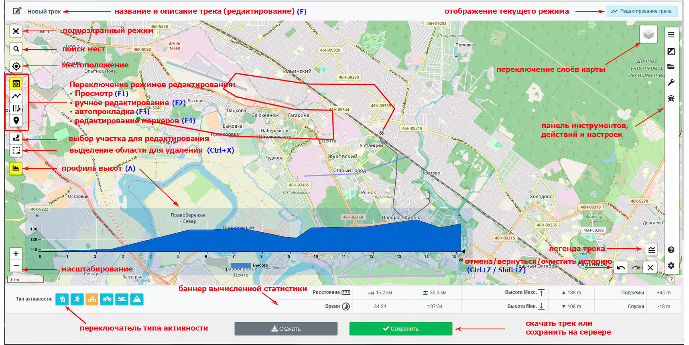

<!-- markdownlint-disable-next-line first-line-heading -->

## Подробное описание интерфейса редактора

Ниже представлена детальная расшифровка всех элементов управления и панелей, указанных на схеме интерфейса:

### ↖️ Левая панель (Навигация и базовые инструменты карты)
* **[1] Полноэкранный режим (Развернуть карту):** Разворачивает рабочую область редактора на весь экран монитора.
* **[2] Поиск мест и адресов:** Позволяет быстро найти населенный пункт, улицу или географический объект и автоматически отцентрировать карту на нем.
* **[3] Моё местоположение (Геолокация):** Запрашивает координаты браузера и мгновенно перемещает карту к текущему физическому местонахождению пользователя.
* **[4] Индикатор масштаба (Линейка):** Отображает текущий масштаб карты (в метрах или километрах) для визуальной оценки расстояний.
* **[5] Кнопки масштабирования (+ / -):** Нативное управление Leaflet для приближения и отдаления карты (также работает колесиком мыши).

### 🎛️ Левая панель инструментов (Режимы редактирования трека)
* **[6] Режим «Просмотр трека» (Клавиша F1):** Базовый режим перемещения по карте. Клики мыши не создают новых точек, позволяя безопасно изучать маршрут.
* **[7] Режим «Ручное рисование» (Клавиша F2):** Классическая пошаговая прокладка маршрута. Каждый клик пользователя на карте создает новую прямую точку трека.
* **[8] Режим «Автопрокладка трека» (Клавиша F3):** Умная прокладка маршрута с привязкой к дорогам и тропам через локальный OSRM-маршрутизатор Велокэта.
* **[9] Режим «Редактор маркеров / Путевых точек» (Клавиша F4):** Включает инструмент установки кастомных путевых знаков, Waypoints и текстовых заметок в координатах трека.
* **[10] Режим «Яндекс.Панорамы» (3D-фотосферы):** Активирует инструмент вызова бесплатных трехмерных панорам Яндекса для визуальной оценки покрытия дорог.
* **[11] Инструмент «Выбор участка для правки»:** Позволяет точечно кликнуть на любой внутренний сегмент или точку трека для начала его локального изменения.
* **[12] Инструмент «Выделение области для удаления» (Ctrl + X):** Активирует рамку захвата: все точки и сегменты трека, попавшие внутрь рамки, будут удалены.

### ↗️ Верхняя панель и Правая панель (Свойства и Оверлеи)
* **[13] Название и описание маршрута (Клавиша E):** Интерактивное текстовое поле в левом верхнем углу для редактирования метаданных и заголовка трека.
* **[14] Статус текущего режима:** Информационная строка вверху справа, отображающая текущую активность редактора («Редактирование трека», «Панорамы» и т.д.).
* **[15] Переключатель базовых карт и оверлеев:** Выпадающее меню Leaflet для смены подложек (OSM, Спутник) и активации фоновых слоев («Хитмап», «Велотреки пользователей»).
* **[16] Панель слайдеров («Затенялка» и «Яркость»):** Кастомные ползунки для регулировки контраста карт и прозрачности Canvas-тайлов векторных треков пользователей.
* **[17] Виджет «Сегменты трека»:** Интерактивное окно со списком всех неактивных и активных сегментов текущего маршрута с кнопками их быстрой фокусировки, скрытия и удаления.

### ⬇️ Нижняя панель (Статистика, История и Экспорт)
* **[18] Панель выбора типа активности:** Кнопки быстрой конфигурации маршрутизатора под конкретный тип поездки (Велосипед, Шоссе, Бег/Пешком, Автомобиль).
* **[19] Управление историей действий (Отмена / Возврат):** Кнопки со стрелками (а также горячие клавиши `Ctrl + Z` и `Ctrl + Y`) для отмены ошибочно поставленных точек или возврата удаленных сегментов.
* **[20] Панель вычисленной статистики и Экспорт:** Динамическое табло, отображающее общее расстояние, время, максимальную/минимальную высоту, наборы высот и спуски, а также финальные кнопки «Скачать GPX» и «Сохранить на сервере».
