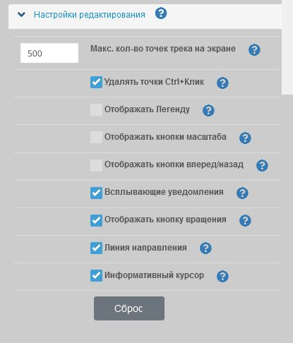

<!-- markdownlint-disable-next-line first-line-heading -->
Перейдите в раздел :fas fa-cog:`Настройки` :fas fa-angle-right:`Настройки редактирования`

?>В случае, если установлено локальное [сохранение настроек](../main-config.md?id=Сохранение-настроек) все нижеследующие настройки текущей сессии будут автоматически применены при последующем входе в редактор в этом браузере, иначе будут применятся настройки по-умолчанию (как указано на картинке).

### Максимальное кол-во точек трека на экране

В режиме редактирования трека при большом количестве редактируемых точек может замедляться работа редактора. Для того чтобы избежать этого, по умолчанию установлено значение 500 редактируемых точек. Таким образом, если на экране будет более указанного кол-ва, редактор перейдет в режим просмотра и предложит приблизить трек, чтобы уменьшить кол-во редактируемых точек. Как только кол-во точек будет меньше указанного значения, редактор вновь перейдет в режим редактирования трека.  
Вы можете настроить этот параметр в зависимости от производительности Вашего браузера, установив максимальное кол-во точек трека на экране, при котором возможно редактирование.  
Для отмены ограничений, установите 0 (не рекомендуется).

### Удалять точки Ctrl+Клик

Если установлено, позволяет удалять точки редактируемого трека сочетанием `Ctrl + Левый клик` мыши.

### Отображать Легенду

Если установлено, то на карте отображается Легенда (список сегментов).
Будет отображено в правом нижнем углу карты в виде кнопки или списка, в зависимости от сохраненного cостояния редактора.
Также можно использовать быструю клавишу `L` для отображения/скрытия Легенды.

Легенда позволяет получить быстрый доступ к добавлению, редактированию названия и описания, просмотру, удалению сегментов, а также позволяет установить [пользовательский цвет сегмента](tracks/track-config.md?id=Пользовательский-цвет-сегментов) трека.  

|Легенда|
|:---:|
|

### Отображать кнопки масштаба

Если установлено, на карте будут отображены кнопки масштабирования `+` и `-`.  
Для масштабирования карты (приблизить/удалить) доступны горячие клавиши: `+/-` (на цифровой клавиатуре) или `+ / Shift +` (на основной клавиатуре)

### Отображать кнопки вперед/назад

В редакторе доступна возможность отменять/возвращать действие. Промежуточные данные хранятся в локальном хранилище браузера и кол-во шагов вперед-назад может быть изменено администратором в зависимости от версии редактора. В данной версии установлено 10 шагов.  
Данные могут быть очищены кнопкой [X].  
Если выбрано, блок с кнопками будет отображен в правом нижнем углу карты.

!> Отмена/Возврат доступны только в текущей сессии.  
При выходе из редактора данные **не сохраняются!**

### Всплывающие уведомления

Если выбрано, то будут показываться всплывающие сообщения о действиях редактора (рекомендуется).
>[!NOTE]
>Cообщения об ошибках будут показаны даже если этот пункт не выбран.

### Отображать кнопку вращения

Позволяет отобразить кнопку-переключатель, с поможью которой можно включить режим вращения/поворота карты мышью или включить режим автоповорота карты для мобильных устройств

### Линия направления

Позволяет видеть, в режиме редактирования, предполагаемую линию от последней точки трека до курсора

### Информатиный курсор

Позволяет включить над курсором подсказку, отображающую в режиме редактирования трека информацию об общем расстоянии трека до курсора, азимуте и расстояннии от последней точки трека, а также координаты места, над которым располагается курсор.

### Единица длины

Позволяет изменить настройки редактора между имперской (мили) и метрической (метры) единицами длины.

### Сохранение настроек

Перейдите в раздел :fas fa-cog: `Настройки`  :fas fa-chevron-right: `Сохранение настроек`

По-умолчанию, статус редактора треков будет постоянно сохраняться в локальном хранилище вашего браузера, поэтому при последующем закрытии и повторном открытии в этом браузере он будет восстанавливать тот же контент и настройки.

При необходимости вы можете скачать все настройки редактора в виде файла и затем загрузив их, применить в любом другом.  
Для этого используйте кнопки `Скачать` и `Загрузить`.

!> **Предупреждение о конфиденциальности:** состояние редактора будет доступно всем пользователям этого профиля браузера.  
Если Вы используете общее/общедоступное устройство, отключите эту функцию. После отключения все данные будут удалены из локального хранилища браузера.
