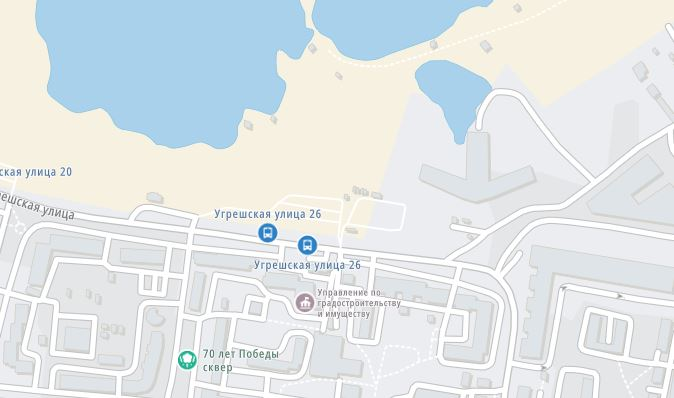

<!-- markdownlint-disable-next-line first-line-heading -->
### Настройка отображения

Для настройки выберите пункт **Конфигурация карт** в выпадающем списке карт/слоёв:

В открывшемся списке можно скрыть неиспользуемые слои/карты и определить порядок их сортировки в меню, путем перетаскивания мышью блоков с названиями карт:

Кнопка "Cбросить" вернет настройки по-умолчанию.

?> Сохранение сортировки произойдет автоматически после закрытия окна сортировки.
Если установлено сохранение в Локальном хранилище, порядок сортировки будет отображаться в этом виде при последующих входах в том браузере, в котором были произведены данные настройки.

*примечание:* все локальные настройки редактора можно [экспортировать](/main-config?id=Сохранение-настроек) в файл для последующего использования в других браузерах или устройствах.

### Список карт

#### предустановленные карты

| тип карты | превью
| --- | :---: |
|OpenStreetMap|
|OpenStreetMap H.O.T.|
|OpenTopoMap|
|CyclOSM|
|OpenCycleMap|
|MtbMap|
|HikeBike|
|Yandex map|
|Yandex map + Traffic|
|Yandex satellite|
|Yandex hybrid|
|Outdoors|
|Transport|
|Landscape|
|MapBox|
|MapBox Streets|
|TomTom|
|Esri WorldStreetMap|
|Esri WorldTopoMap|
|Esri WorldImagery|
|Esri WorldGrayCanvas|
|HERE|
|HERE satellite|
|HERE hybrid|
|Google Roadmap|

#### предустановленные слои наложения

| тип слоя | превью
| ---------| :----: |
|Geocashing|
|HikeBike.HillShading|
|OpenRailwayMap|
