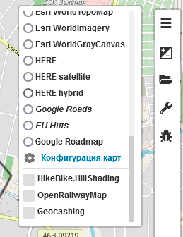
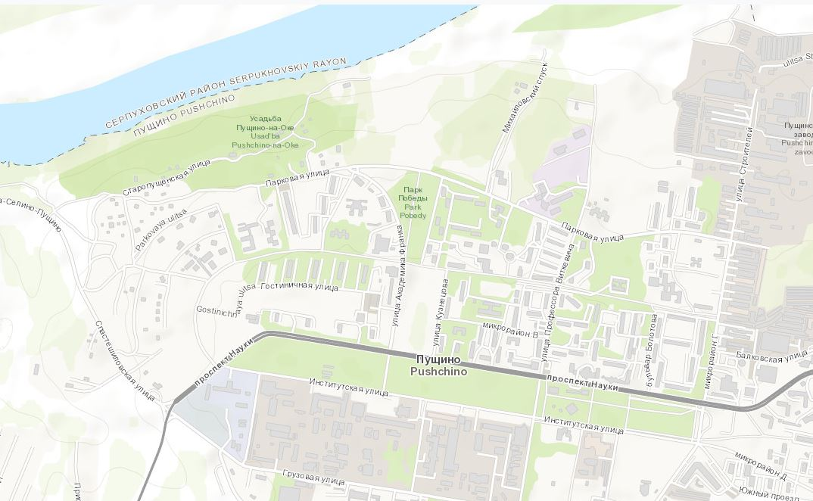
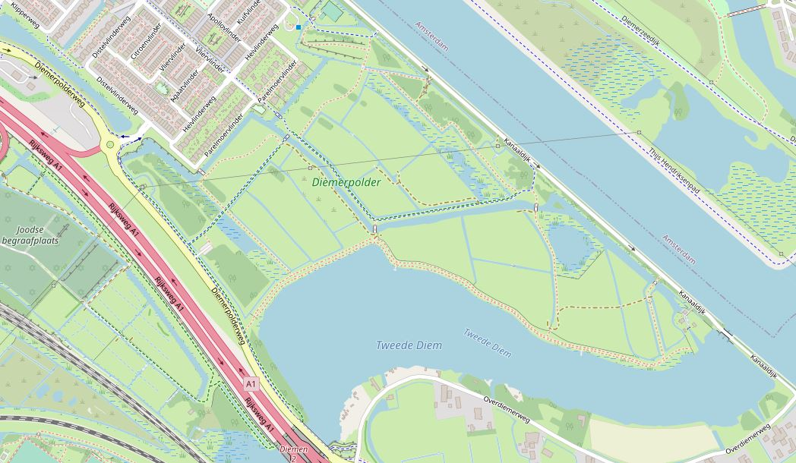

<!-- markdownlint-disable-next-line first-line-heading -->
### Настройка отображения

Для настройки выберите пункт :fas fa-cog:`Конфигурация карт` в выпадающем списке карт/слоёв:

|    |
|:--:|
|

В открывшемся списке можно:

- скрыть :fa fa-eye: неиспользуемые слои/карты;
- определить порядок их сортировки в меню, путём :fa fa-hand-pointer: перетаскивания блоков с названиями карт

|    |
|:--:|
|

Кнопка `Cбросить` вернет настройки по-умолчанию.  
Назначение других кнопок описано в разделе [персональные карты](/maps/maps-personal.md)

>[!NOTE]
> Сохранение сортировки произойдет автоматически после закрытия окна настроек.
> Если установлено сохранение в Локальном хранилище, порядок сортировки будет отображаться в этом виде при последующих входах в том браузере, в котором были произведены данные настройки.

>[!TIP]
> Локальные настройки редактора можно [экспортировать](/main-config?id=Сохранение-настроек) в файл для последующего использования в других браузерах или устройствах.

### Список карт

#### предустановленные карты

| тип карты | превью| по-умолчанию
| ---------| :----: | :----: |
|OpenStreetMap|| :heavy_check_mark:
|OpenStreetMap H.O.T.|| :heavy_check_mark:
|OpenStreetMap German|| :lock:
|OpenStreetMap France|| :lock:
|OpenStreetMap Breton|| :lock:
|CyclOSM|| :heavy_check_mark:
|OpenTopoMap|| :heavy_check_mark:
|OpenCycleMap|| :heavy_check_mark:
|MtbMap|| :heavy_check_mark:
|HikeBike|| :heavy_check_mark:
|Yandex map|| :heavy_check_mark:
|Yandex map + Traffic|| :heavy_check_mark:
|Yandex satellite|| :heavy_check_mark:
|Yandex hybrid|| :heavy_check_mark:
|Outdoors|| :heavy_check_mark:
|Landscape|| :heavy_check_mark:
|Transport|| :heavy_check_mark:
|Transport Dark|| :lock:
|OPNVKarte|| :lock:
|Pioneer|| :lock:
|MobileAtlas|| :lock:
|MapBox|| :heavy_check_mark:
|MapBox Streets|| :heavy_check_mark:
|TomTom|| :heavy_check_mark:
|Esri WorldStreetMap|| :heavy_check_mark:
|Esri WorldTopoMap|| :heavy_check_mark:
|Esri WorldImagery|| :heavy_check_mark:
|Esri WorldGrayCanvas|| :heavy_check_mark:
|HERE|| :heavy_check_mark:
|HERE satellite|| :heavy_check_mark:
|HERE hybrid|| :heavy_check_mark:
|Google Roadmap|| :lock:
|Jawg Streets|| :lock:
|Jawg Terrain|| :lock:

#### предустановленные слои наложения

| тип слоя | превью | по-умолчанию
| ---------| :----: | :----: |
|Geocashing|| :heavy_check_mark:
|HikeBike.HillShading|| :heavy_check_mark:
|OpenRailwayMap|| :heavy_check_mark:
|WaymarkedTrails hiking|| :heavy_check_mark:
|WaymarkedTrails mtb|| :heavy_check_mark:
|WaymarkedTrails slopes|| :heavy_check_mark:
|WaymarkedTrails riding|| :lock:
|WaymarkedTrails skating|| :lock:
|OpenSnowMap|| :heavy_check_mark:
|OpenSeaMap|| :lock:
