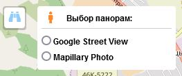
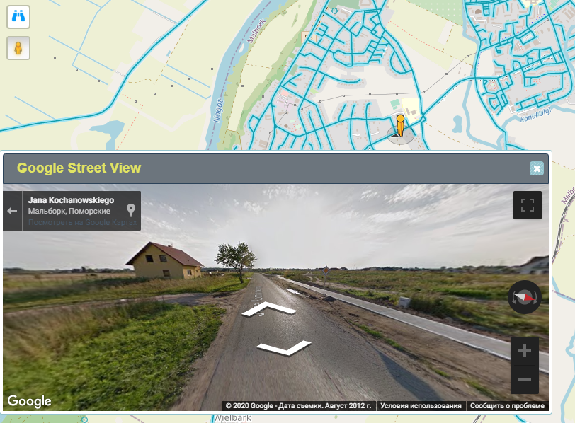
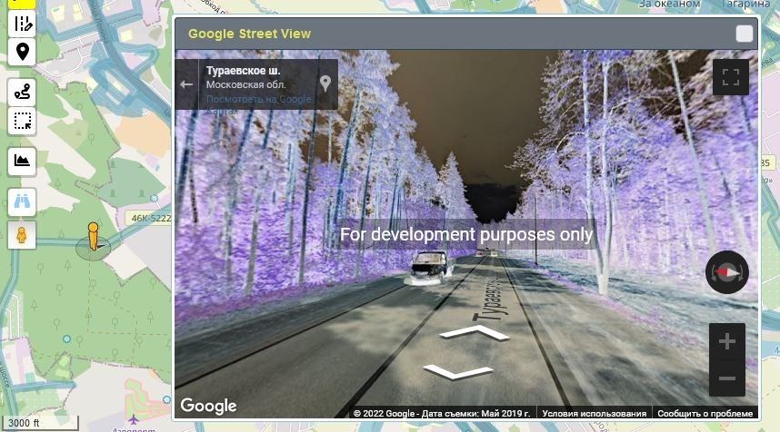

<!-- markdownlint-disable-next-line first-line-heading -->
!> Данный раздел находится в разработке! [ТОDO](../todo.md)

1. Включите режим просмотра панорам  
   

1. В открывшемся окне выберите вид панорамы  
   

1. Перетащите появившегося человечка (Pegman) в точку на карте, где хотите начать обзор  
   

1. Окно панорамы можно перетаскивать по экрану и изменять его размер.

1. Передвигайте "человечка" по карте или используйте кнопки навигации в окне просмотра для изменения обзора панорам

1. Для выхода из режима просмотра панорам, закройте окно просмотра и повторно нажмите на кнопку панорам, чтобы отключить их наложение на карте.  
   О включенном состоянии режима панорам символизирует синий цвет иконки :fa fa-binoculars:

### Google-панорамы

!> Для просмотра Google-панорам необходим API-ключ

|c API-ключем|без API-ключа
|:---:|:---:|
||

### Mapillary

>[!DANGER]
>Панорамы MAPILLARY в данный момент отключены, до момента, когда будет найдено решение проблемы запросов к их серверам.  
>Проблема возникла в связи с внедренным разработчиками обновлением API-Mapillary до 4 версии :sad:

**Внешний вид панорам Mapillary:**  

