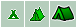
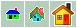

<!-- markdownlint-disable-next-line first-line-heading -->
### Добавление

1. Перейдите в режим `"Редактирования маркеров"` (F4)  

   

2. Нажмите на карте в точке, где хотите установить новый маркер
3. В открывшемся "баллуне" укажите название, выберите тип маркера (символ) из списка, и при необходимости добавьте описание.  
  По умолчанию будут установлены значения как указано на картинке:

  | |
  | :---: |
  |

- **Название:** то что будет отображаться в подсказках к маркеру при наведении на него или рядом, если установлено в настройках.
- **Символ:** выбирается из предустановленных в выпадающем списке. Символ отображает тип объекта, для которого устанавливается этот маркер. Подробнее о предустановленых символах и их соответствиям см. раздел [Типы маркеров](markers/marker-add.md?id=Типы-маркеров)
- **Описание:** подробное описание объекта или места.  Используется обычный текст или HTML, например, если необходимо вставить картинку или сделать оформление. Предпочтительно использовать обычный текст, т.к. не все устройства или программы могут правильно воспроизвести HTML.
  Для более корректного ввода HTML форматирования включите режим визуального редактора, уcтановив флажок  
  - [x] **"Оформленный текст"**.
- **Координаты:** устанавливаются автоматически.
- **Высота:** устанавливается автоматичеси и может быть скорректирована вручную.  
  
>[!NOTE]
>*При первоначальной установке маркера высота может быть еще не получена от сервера высот.  
>Для проверки корректности получения высоты можно закрыть баллун маркера и открыть его снова, нажав на значок маркера*.

-----

### Редактирование

1. Перейдите в режим `Редактирования маркеров` (F4)  
2. Для изменения данных маркера, нажмите на него, далее см. ["Добавление" п.3](markers/marker-add.md?id=Добавление)
3. Для изменения местоположения закройте баллун(если открыт) и переместите маркер в нужную точку на карте.

-----

### Типы маркеров

| символ                        | тип         | &lt;sym&gt; [1](#f1) | соответствие Garmin [2](#f2)
| :---------------------------: | :---------: | :---------: | :------------------------------------------: |
| :fa fa-map-marker-alt fa-fw fa-lg:  |по умолчанию |Waypoint     | 
| :fa fa-subway fa-fw fa-lg:          |Станция      |Railway      | 
|:fa fa-tram fa-fw fa-lg:             |Фуникулер    |Funicular    | 
|:fa fa-utensils fa-fw fa-lg:         |Еда          |Restaurant   | 
|:fab fa-free-code-camp fa-fw fa-lg:  |Привал (костёр)|Picnic Area| 
|:fa fa-grip-lines fa-fw fa-lg:       |Мост         |Bridge       | 
|:fa fa-water fa-fw fa-lg:            |Брод         |brod         | -
|:fa fa-dungeon fa-fw fa-lg:          |Пещера       |cave         | -
|:fa fa-times fa-fw fa-lg:            |Перевал      |Crossing     | 
|:fa fa-mountain fa-fw fa-lg:         |Вершина, гора|Summit       | 
|:fa fa-times fa-fw fa-lg:            |Пересечение  |Crossing     | 
|:fa fa-campground fa-fw fa-lg:       |Кемпинг      |Campground   | 
|:fa fa-caravan fa-fw fa-lg:          |Автокемпинг  |RV Park      | 
|:fa fa-bed fa-fw fa-lg:              |Отель        |Lodging      | 
|:fa fa-tint fa-fw fa-lg:             |Питьевая вода|Drinking Water| 
|:fa fa-shower fa-fw fa-lg:           |Душ          |Shower       | 
|:fa fa-plug fa-fw fa-lg:             |Электричество|plug         | -
|:fa fa-home fa-fw fa-lg:             |Дом, жильё   |Residence    | 
|:fab fa-fort-awesome fa-fw fa-lg:    |Достопримечательность|sight| -
|:fa fa-monument fa-fw fa-lg:         |Монумент, памятник|monument| -
|:fa fa-landmark fa-fw fa-lg:         |Музей        |Museum       | 
|:fa fa-info-circle fa-fw fa-lg:      |Информация   |Information  | 
|:fa fa-exclamation-triangle fa-fw fa-lg:|Внимание! |attention    | -
|:fa fa-skull-crossbones fa-fw fa-lg: |Опасность    |Skull and Crossbones| 
|:fa fa-lightbulb fa-fw fa-lg:        |Идея         |Light        | 
|:fa fa-star fa-fw fa-lg:             |Звезда       |generic      | -
|:fa fa-heart fa-fw fa-lg:            |Избранное    |Favorite     | 
|:fas fa-tree fa-fw fa-lg:            |Парк, лес    |Park         | 
|:fa fa-umbrella-beach fa-fw fa-lg:   |Пляж         |Beach        | 
|:fa fa-swimmer fa-fw fa-lg:          |Место для купания|Swimming Area| 
|:fa fa-restroom fa-fw fa-lg:         |Туалет       |Restroom     | 
|                               |Геокешинг    |Geocache     | 
|:fa fa-ambulance fa-fw fa-lg:        |Медицинская помощь|Medical Facility| 
|:fa fa-compress-arrows-alt fa-fw fa-lg:|Место встречи|meeting    | -
|:fa fa-map-signs fa-fw fa-lg:        |Указатель    |plate        | -
|:fa fa-arrow-left fa-fw fa-lg:       |Налево       |left         | -
|:fa fa-arrow-right fa-fw fa-lg:      |Направо      |right        | -
|:fa fa-undo fa-fw fa-lg:             |Назад        |TracBack Point| 
|:fa fa-ban fa-fw fa-lg:              |Стоп         |Stop         | 
|:fa fa-flag fa-fw fa-lg:             |Флаг         |Flag         | 
|:fa fa-flag-checkered fa-fw fa-lg:   |Финиш        |finish       | -
|:fa fa-eye fa-fw fa-lg:              |Обзор        |Flag, Red    | 
|:fa fa-camera-retro fa-fw fa-lg:     |Фото         |Scenic Area  | 
|:fa fa-shield-alt fa-fw fa-lg:       |Полиция      |Police Station| 
|:fa fa-passport fa-fw fa-lg:         |Пасспортный контроль|passport| -
|:fa fa-church fa-fw fa-lg:           |Церковь      |Church       | 
|:fa fa-mosque fa-fw fa-lg:           |Мечеть       |mosque       | -
|:fa fa-dollar-sign fa-fw fa-lg:      |Банк         |Bank         | 
|:fa fa-hand-holding-usd fa-fw fa-lg: |Банкомат     |cash         | -
|:fa fa-plane fa-fw fa-lg:            |Аэропорт     |Airport      | 
|:fa fa-anchor fa-fw fa-lg:           |Причал       |Anchor       | 
|:fa fa-futbol fa-fw fa-lg:           |Стадион      |Stadium      | 
|:fa fa-cart-plus fa-fw fa-lg:        |Магазин      |Shopping Center| 
|:fa fa-prescription fa-fw fa-lg:     |Аптека       |Pharmacy     | 
|:fa fa-clinic-medical fa-fw fa-lg:   |Больница     |Hospital, Euro| 
|:fa fa-tools fa-fw fa-lg:            |Сервис, ремонт|service     | -
|:fa fa-trash-alt fa-fw fa-lg:        |Мусор        |trash        | -
|:fa fa-bacon fa-fw fa-lg:            |Водопад      |waterfall    | -
|:fa fa-fish fa-fw fa-lg:             |Рыбылка      |Fishing Area | 
|:fa fa-biking fa-fw fa-lg:           |Велодорожка  |Bike Trail   | 
|:fa fa-parking fa-fw fa-lg:          |Парковка     |Parking Area | 

<b id="f1"> [1] </b> *&lt;sym&gt; - значение тега точки трека (wpt), который используется другими программами и устройствами для отображения соответствующего символа.* [↩](#a1)  
<b id="f2"> [2] </b> *Соответствие названия символа &lt;sym&gt; изображениям, использумыми Garmin. [Полная таблица символов](/markers/garmin.md)  
    В трех ячейках указаны соответствующие символы для: mapsource, gpsmap и 24х24 (basecamp).* [↩](#a2)

>[!NOTE]
>В случае использования значка не имеющего "соответствия" программе/прибору, поле `sym` будет проигнорировано и значок точки будет отображен как установлено в программе/приборе по-умолчанию. Например, для устройств Garmin это будет `Waypoint`
