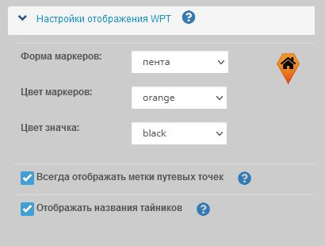

<!-- markdownlint-disable-next-line first-line-heading -->
?> Данные настройки будут применены как к внешнему виду редактора треков, так и к отображению при просмотре.  
Они не будут использованы в самом треке при его скачивании.  
Значки маркеров будут преобразованы в соответствии с [таблицей](marker-add.md?id=Типы-маркеров) для максимальной совместимости с программами и устройствами.  

Для кофигурации отображения маркеров перейдите в **Настройки** раздел **Настройки отображения WPT**:

### Вид маркеров

> Доступные параметры:
>
>- Форма маркеров (круглый, квадратный, звезда, пента);
>- Цвет маркеров;
>- Цвет значка/символа на маркере;

|Таблица доступных видов маркеров (без наложения символов): |
| :---: | 
|

### Отображение названий маркеров 
Если флажок "Всегда отображать метки путевых точек" не установлен, 
заголовок/название маркера отображается только тогда, когда мышь находится над ним.

|вкл.|выкл.
|----|----|
|  | 

### Отображение названий тайников
Если флажок "Отображать названия тайников" установлен, 
рядом с маркером тайника будет отображаться его название.

(Только при включенном слое "Геокешинга")

|вкл.|выкл.
|----|----|
|  | 
