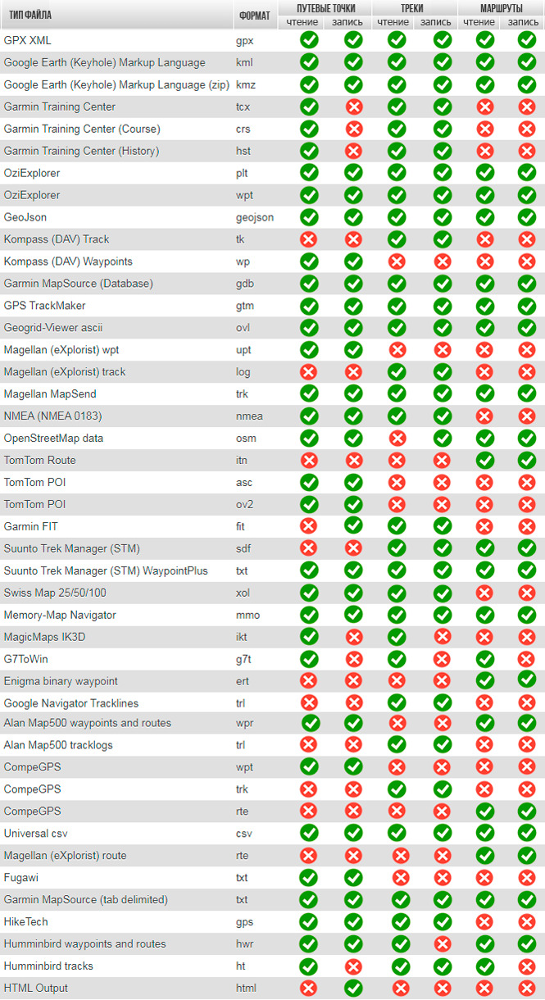
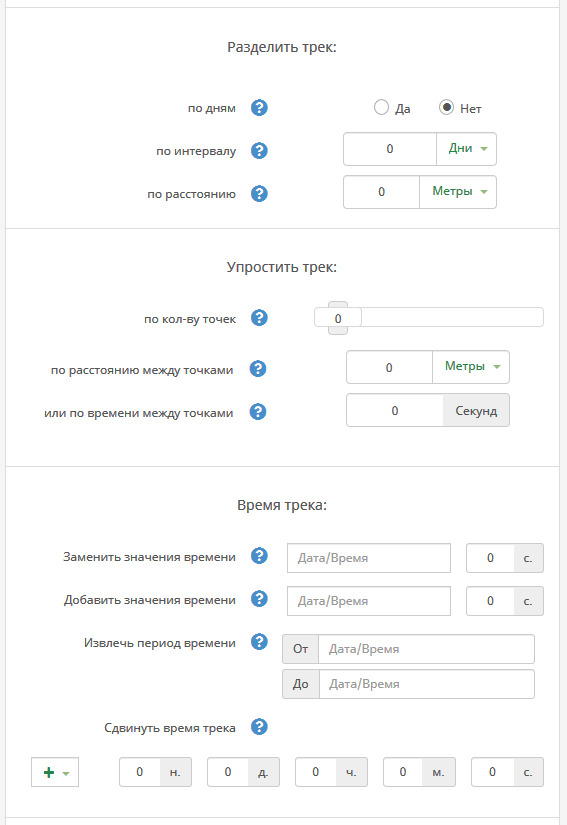
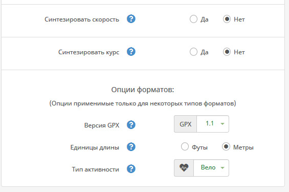

### Поддерживаемые форматы
Конвертер предназначен для конвертации треков, маршрутов и маршрутных точек между разными форматами. 

Таблица поддерживаемых форматов:

### Возможности:

- изменение названия файла и названия трека/маршрута (далее просто трек) в самом файле;

- преобразование трека в маршрут;

- скачивание в сжатом виде (zip). Причем, если на выходе подразумевается несколько файлов, они будут помещены в архив автоматически. (Пример: трек и точки для Ozi - выход будет содержать файл трека .plt и файл точек .wpt, они будут скачаны как один архив). Также выходной формат KMZ всегда является zip-архивом;

- реверс трека (обратить): смена порядка точек трека в обратном направлении;

- объединить как сегменты: Эта опция объединяет несколько треков, преобразуя их в сегменты одного трека;

- разделить сегменты на треки: Противоположная опция - если есть сегменты в треке, они будут представлены как отдельные треки;

- слияние треков. Предположим есть два трека, записанных с разных устройств, применив эту опцию, мы получим один трек, где избыточные точки, с одинаковыми отметками времени будут удалены;

- разделение треков:

    по дням: трек будет разделен на несколько, по дням. Полезно для тех, кто пишет общий трек похода, а потом хочет видеть дни как отдельные треки
    по интервалу или времени: установив расстояние или время или и то и другое, можно разделять трек на несколько, если превышено одно из этих значений, например между точками больше километра или больше часа.

- упрощение трека:

    по кол-ву точек трека: фильтр будет пытаться удалить точки до тех пор, пока не будет достигнуто значение (макс. 1000), стараясь максимально точно сохранить форму трека.
    по расстоянию между точками: удаляются точки, которые находятся ближе указанного расстояния
    по времени между точками: то же что и расстояние, но только по установленному времени, например, удаляются точки, между которыми менее 5 сек.

- время трека:

    можно полностью заменить все значения времени, установив начальную дату и время, и указав шаг между точками, например 5 сек.;
    добавить значения времени: Если у каких либо точек трека отсутствуют метки времени, они будут установлены согласно указанному и каждая последующая будет установлена с указанным шагом;
    извлечь период времени: Указав дату/время начала и окончания (опционально), можно отфильтровать точки трека, оставив только те, которые попадают в этот диапазон;
    сдвинуть время трека: выбрав значения, можно сдвинуть время всех точек трека на указанный интервал.

- Синтезировать скорость и курс: если выходной формат поддерживает эти данные, то будут рассчитаны и добавлены для каждой точки скорость (м/с) и курс (град.)

- Доп. опции (только для некоторых форматов)

  версия GPX (только для .gpx) - позволяет изменить версию выходного файла. Так, например, версия gpx 1.1 не поддерживает данные скорости и курса, для добавления их, нужно будет выбрать версию 1.0
  Единицы длины (метры/футы): в некоторых форматах можно изменить систему измерения длин и высот
  Тип активности: Для некоторых форматов Garmin Training, например tcx или crs, можно выбрать тип активности: Вело, Бег и прочее. В этом случае файл сохранится как активность.

### Особенности:
Главным отличием конвертера от аналогов является возможность пакетной обработки файлов. Для этого нужно загрузить файлы, заархивированные предварительно в ZIP. А на выходе получить итоговый файл, полученный из всех файлов в этом zip-архиве. 
Причем файлы не обязательно должны быть одного формата. Предположим, что  есть трек в формате .gpx(стандартый Garmin-овский формат) и точки в формате .wpt (OziExplorer). Загрузив оба файла как zip архив, на выходе получим один файл в выбранном формате, содержащий все данные из архивных файлов.