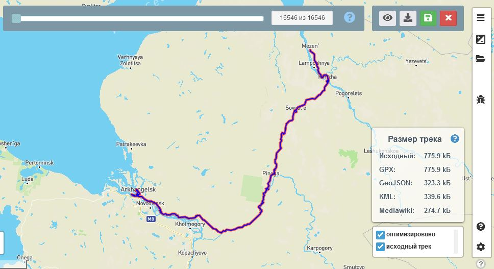
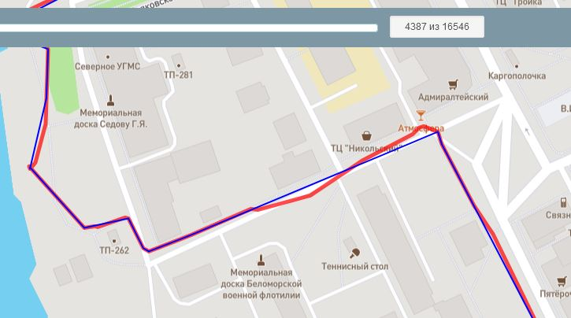

<!-- markdownlint-disable-next-line first-line-heading -->
#### Описание

**Оптимизатор** - встроенный инструмент позволяющий уменьшить размер трека путем сокращения количества точек линии, без значительных потерь качества.  

Для оптимизации используется алгоритм ["Дугласа-Пеккера"](https://ru.wikipedia.org/wiki/%D0%90%D0%BB%D0%B3%D0%BE%D1%80%D0%B8%D1%82%D0%BC_%D0%A0%D0%B0%D0%BC%D0%B5%D1%80%D0%B0_%E2%80%94_%D0%94%D1%83%D0%B3%D0%BB%D0%B0%D1%81%D0%B0_%E2%80%94_%D0%9F%D0%B5%D0%BA%D0%B5%D1%80%D0%B0).  

#### Уведомления

- При загрузке трека или открытии сохраненного в редакторе, в случае, если количество точек трека превышает 2000, пользователю предлагается оптимизировать трек.
- В случае сохраненного на сервере трека, пользователь может выбрать "не предлагать". В этом случае именно для этого трека уведомление больше не будет показываться.
- Пользователь может полностью отключить уведомления, предлагающие оптимизацию, в настройках редактора.

#### Оптимизация

- перейти в оптимизатор можно из уведомления (см.выше) или из меню "Дополнительные инструменты". В этом случае будет использован текущий активный трек (сегмент). Трек/сегмент должен содержать хотя бы 10 точек, чтобы его можно было открыть в Оптимизаторе.
  
- На карте отображаются два трека: исходный - красного цвета, оптимизированный - синего

- Передвигая слайдер вверху карты можно выбрать оптимальную оптимизацию, при которой сохранится желаемое качество трека. Рядом со слайдером выводится информация о кол-ве точек в новом трека по отношению к исходному.
  
  

- В окне "размер трека" отображаются размеры исходного и оптимизированного трека в разных форматах. На сервере трек сохраняется в формате GPX, остальные форматы представлены информационно, в случае, если необходимо скачать отдельно оптимизированный трек.
  >[!NOTE]
  >Данный размер следует рассматривать как ориентировочный, т.к. в нем отображается только размер линии трека. Не учитываютя данные точек (маркеров) и дополнительные метаданные и расширения.
- Под окном "размер трека" находится переключатель, позволяющий включать/отключать на карте отображение определенных треков.

#### Панель действий
  

1. :fas fa-fw fa-eye fa-lg: - просмотреть содержимое оптимизированного трека в нужном формате: GPX, KML, Geojson, Mediawiki

1. :fas fa-fw fa-download fa-lg: - скачать оптимизированный трек в нужном формате: GPX, KML, Geojson, Mediawiki
   >[!NOTE]
   >При просмотре и скачивании трека игнорируются метаданные, если они присутствуют в треке.  
   Точки (маркеры) сохраняются в исходном виде.

1. :fas fa-fw fa-save fa-lg: - перейти к редактированию, с использованием оптимизированного трека  

   !>Данное дейтвие **не сохраненяет** оптимизированный трек на сервере, а возвращает оптимизированный трек в редактор, в котором уже можно сохранить трек в хранилище на сервере.

1. :fas fa-fw fa-times fa-lg: - закрыть Оптимизатор, вернувшись в редактор, в этом случае никаких изменений с треком произведено не будет
