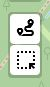
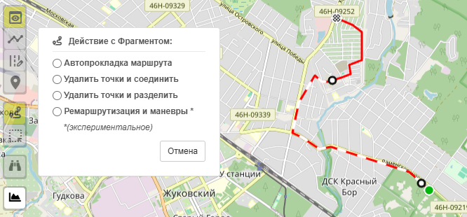
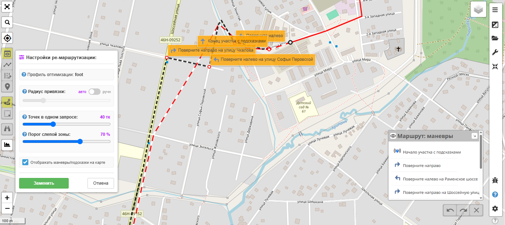
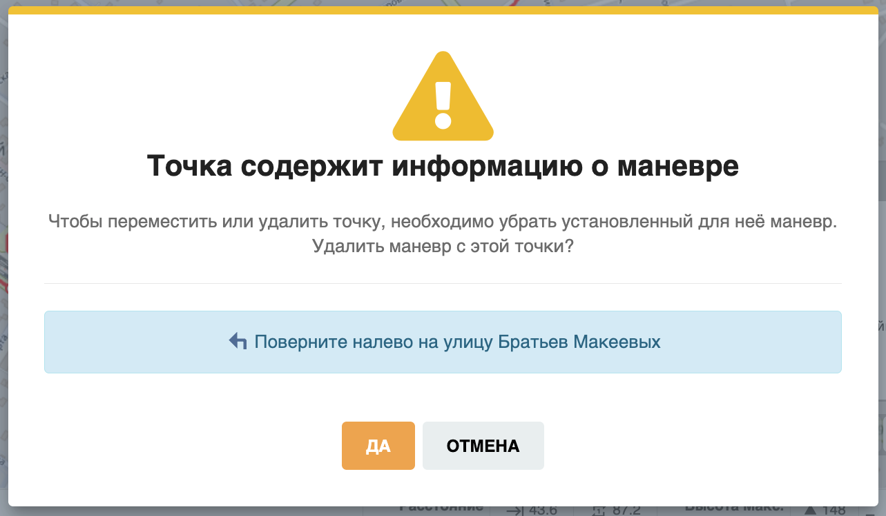
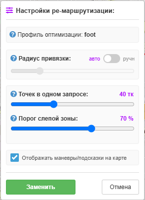
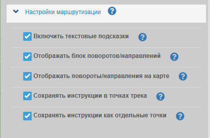
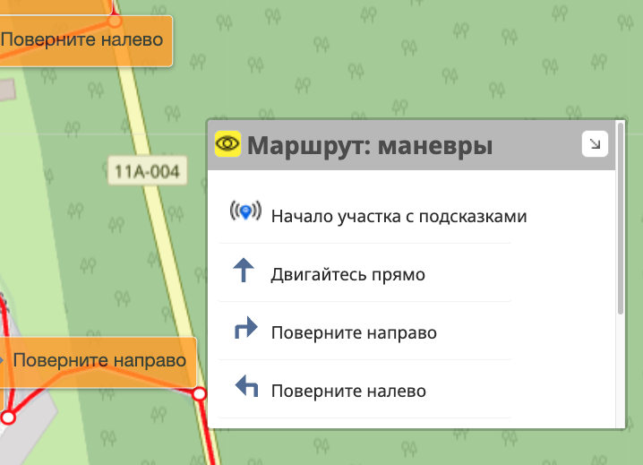
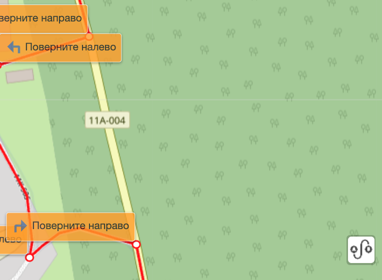
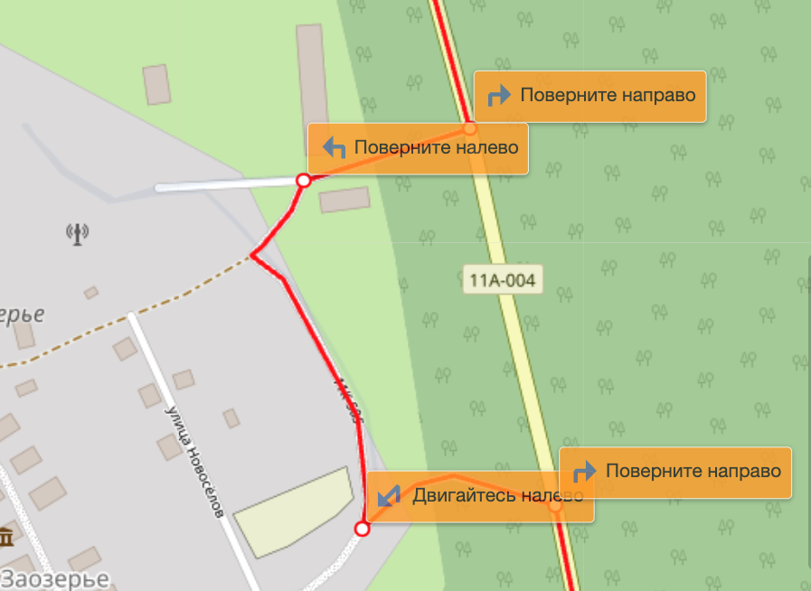
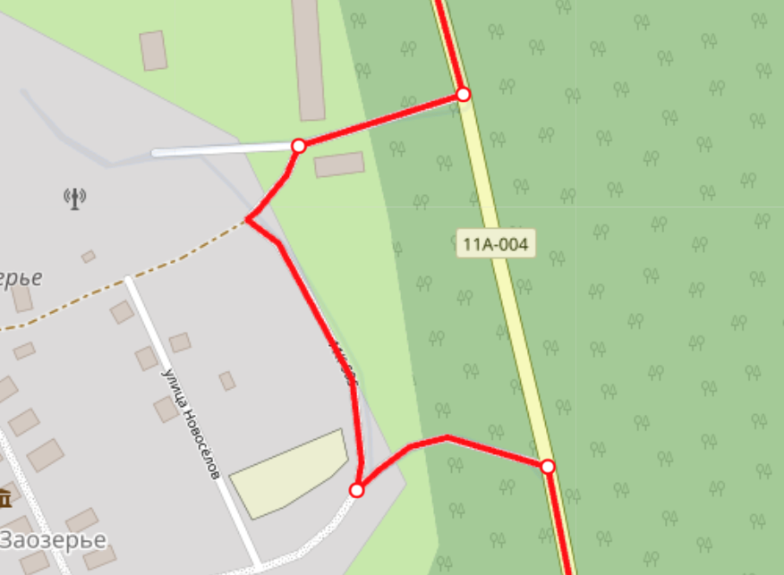

## 🔀 Рероутер (Оптимизатор маршрута)

----

### 🗺️ Краткое описание 
Рероутер — это специализированный инструмент в редакторе треков, который используется как одна из возможностей обработки выделенного фрагмента трека. 

Инструмент берёт выбранный вами отрезок пути и автоматически привязывает его к реальной, актуальной сетке дорог на карте. Он сглаживает линии от случайных прыжков GPS, рассчитывает точный километраж, находит развязки и генерирует для этого фрагмента пошаговые навигационные подсказки (*«Поверните налево»*, *«Двигайтесь прямо»*), которые затем можно зашить в итоговый GPX-файл для навигаторов или часов.

Если выделенный фрагмент заходит в глухой лес или на бездорожье, инструмент автоматически сохраняет исходную геометрию ваших лесных троп, не ломая маршрут.

!>Важно! Собственный Velocat-Router (маршрутизатор) в текушей версии использует для построения маршрутов **ТОЛЬКО** российские регионы.

-----
### 💻 Использование:
1. Используйте инструмент :fa fa-route:" выделение фрагмента" на треке. По этому фрагменту будет произведен рассчет и ремаршрутизация. Описание всех возможностей с [фрагментами](/tracks/track-segments.md)

2. После выделения нужного фрагмента, выберите в открывшемся меню инструмент "Рероутинг и маневры".

3. Сразу же будет построено превью предлагаемого маршрута (черная прерывистая линия).

4. В случае если Вас устраивает предложенный вариант, нажмите "Заменить" и новый фрагмент маршрута, проложенный по реальным дорогам с подсказками маневров, заменит выделенный ранее фрагмент (участок).
5. Если Вас не устраивает новый маршрут, или он проложен с ошибками (например построился по слишком отдаленным дорогам, на маршруте есть выбросы точек или маршрут не построился вообще), то можете нажать конпку "Отмена" и выбрать другой сегмент (например меньше размером), либо же воспользоваться тонкими настройками Ремаршрутизации, описанными ниже.

!> Точки в которых помещен маневр при дальнейшем редактировани нельзя будет перемещать или удалять, во избежании нарушения логики этого маневра. При попытке это сделать, будет предложено удалить маневр из этой точки:
> 

----

### 🛠️ Настройка параметров для выделенного фрагмента

Для точной настройки обработки выделенного участка используются три ползунка:

#### 1. Профиль оптимизации
Устанавливается соответственно выбранному типу активности и определяет преимущество выбираемых дорог, так например для **car** тропы и лесные дороги будут иметь очень низкий приоритет по сравнению с шоссе, а для **foot** наоборот.

#### 2. Радиус привязки (в метрах)
Указывает, в каком радиусе от выделенного фрагмента система будет искать дороги, чтобы «притянуть» к ним линию трека.
* **Как настроить:** Для обычных улиц, городов и шоссе выставляйте **30–50 метров**. Если задать слишком большой радиус в лесу, инструмент может ложно утянуть выделенный фрагмент на ближайшую крупную автотрассу, проходящую в паре сотен метров от вашей просеки.

#### 3. Точек в одном запросе (чанки)
Показывает, на сколько мелких кусочков (чанок) Рероутер внутри себя разбивает выделенный фрагмент, чтобы отправить их на расчёт сервера.
* **Как настроить:** Базовое значение — **40 точек**. Если выделенный фрагмент проходит по очень завалистому, извилистому лесу с кучей развилок, уменьшайте размер точек в запросе до **15–20 точек**. Так системе будет гораздо проще обработать этот сложный отрезок, и редактор гарантированно не зависнет в ожидании ответа сервера.

#### 4. Порог слепой зоны (в процентах)
Определяет поведение инструмента на фрагментах бездорожья, где официальных автомобильных дорог нет (для навигаторов это «слепая зона»).
* **Как настроить:** Стандартный порог — **70%**. Если на выделенном фрагменте количество лесных завалов и необозначенных троп превысит этот процент, Рероутер поймет, что автонавигации здесь быть не может. Он мгновенно отключит расчёт маневров для этого куска и бережно прорисует путь строго по вашей исходной подробной линии трека, выведя подсказку: *«Участок без автонавигации, следуйте по треку»*.

#### 5. Отображать маневры/подсказки на карте (чекбокс) 
Включает/выключает отображение тултипов (подсказок) над точками на карте. 
* Состояние синхронизировано включению/выключению :fa fa-eye: подсказок в блоке-легенде "маршруты/маневры"  и чекбоксу в конфигурации "Настройки маршрутизации" (т.е. при изменении в одном из этих мест, в остальных это состояние установится автоматически). 
* Эта настройка сохраняет свое состояние в браузере (при повторном открытии редактора), если сохранение разрешено в настройках редактора.

>[!INFO]
>По умолчанию используются следующие настройки рероутера:
> - `Профиль оптимизации` [foot] [bike] [car]  - зависит от вида выбранной активности.
> - `Радиус привязки` устанавливается автоматически для каждой точки трека индивидуально и рассчитывается от плотности/разреженности точек в данном месте трека. Переключение на ручной режим (доступно только для залогиненных пользователей), позволяет установить фиксированный радиус поиска дорог, но для всех точек он будет одинаковый.
> - `Точек в одном запросе (чанки):` 40тк - количество точек отправляемых последовательно на сервер для расчета. 
> - `Порог слепой зоны:` 70% - процент не найденных дорог радом с точками, например в лесу, когда участок останется таким же как оригинальный трек.
>
>В обычном случае этих настроек достаточно, если нет, можно их изменить, смотрите подробное описание ниже. (прим.: любое изменение настроек приводит к немедленному перерасчету превью)
>
----

### 🛠️ Настройка параметров отображения и сохранения
Для кофигурации отображения подсказок и их сохранения в треке перейдите в :fas fa-cog:`Настройки`:fas fa-angle-right:`Настройки маршрутизации`:

#### 1. Включить текстовые подсказки
Использовать текстовые подсказки направлений при автопрокладке маршрута. Если отключено, подсказки (маневры) не рассчитываются и не отображаются. 
Такэе отключает остальные пункты данной настройки для изменения.

#### 2. Отображать блок поворотов/направлений
Показывать на карте список поворотов и направлений маршрута.
Будет отображено в виде кнопки или списка (Легенда маневров), в зависимости от сохраненного состояния редактора.
Свернуть легенду маневров в кнопку можно нажав стрелочку в правом верхнм углу

|выкл.|раскрыт|закрыт
|----|----|----|
| не отображается на карте |  | 

#### 3. Отображать повороты/направления на карте
Показывать на карте тултипы (надписи-подсказки) для поворотов и направлений маршрута. Если отключено, то подсказки появляются только при наведении на точку или на пункт в легенде маневров)

|вкл.|выкл.
|----|----|
|  | 

#### 4. Сохранять инструкции в точках трека
Сохранять инструкции в точках трека для поворотов/направлений маршрута (к точке будут добавлены тэги cmt, namr, desc)

#### 5. Сохранять инструкции как отдельные точки
Сохранять инструкции как отдельные точки (WPT) для поворотов/направлений маршрута. Будут отображаться как отдельные маркеры.

