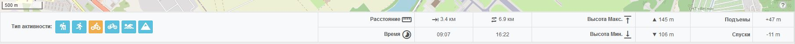
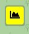
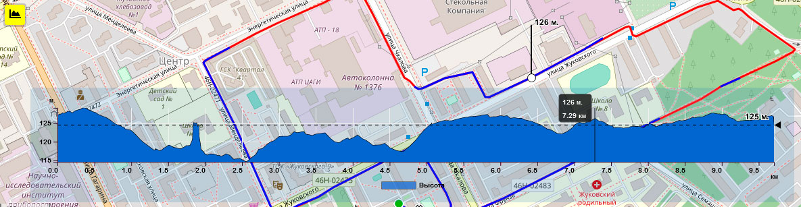

-----

## Блок статистики

**Статистика трека рассчитывается из данных:**

> полученых из трека:
>
>- расстояние и растояние туда-обратно (рассчитывается автоматически)
>- максимальная высота трека (при наличии высот точек в треке)
>- минимальная высота трека (при наличии высот точек в треке)
>- суммарное кол-во подъемов (при наличии высот точек в треке)
>- суммарное кол-во спусков (при наличии высот точек в треке)
>
> в зависимости от выбранного типа активности:
>
>- рассчетное время трека, туда и туда-обратно (см. примечание)
>

>[!NOTE]
>активность учитывается не только для рассчета времени трека, но и будет указана как аттрибут трека при сохранении на сервере, а также будет указана при скачивании трека, если скачиваемый формат поддерживает указание активности, например "Garmin Training Center" ( `.tcx`, `.crs`, `.hst` ). При сохранении файла в этом формате, файл будет сохранен как история (при наличии в файле курса, он будет проигнорирован). Подробнее см. в [Конвертер - Опции форматов](../tools/converter.md)

>[!NOTE]
> Рассчетное время туда и туда-обратно не является простым умножением времени на два, а учитывает время движения в зависимости от подъемов/спусков, если это применимо для формулы рассчета выбранной активности.

>[!TIP]
>В случае если трек или его часть не содержат высот, что видно визуально на профиле высот, можно использовать инструмент [рассчета высот](../tools/tools-editor.md?id=Высоты) для рассчета новых высот.

-----

## Профиль высот

Для активации/дезактивации профиля высот предназначена кнопка  

Горячая клавиша: `L`

**При наведении мышью на профиль высот отображаются:**  

- на графике: данные высоты (м.) и расстояния (км.) в данной точке. [_TODO_](../todo.md) - имперские значения
- на треке: маркер в данной точке с указанием высоты

**при перемещении на графике -----◀ (линейка высот)**, на треке будут выделяться другим цветом участки, находящиеся выше выбранной высоты
