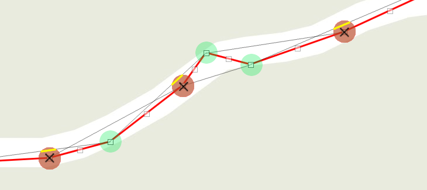
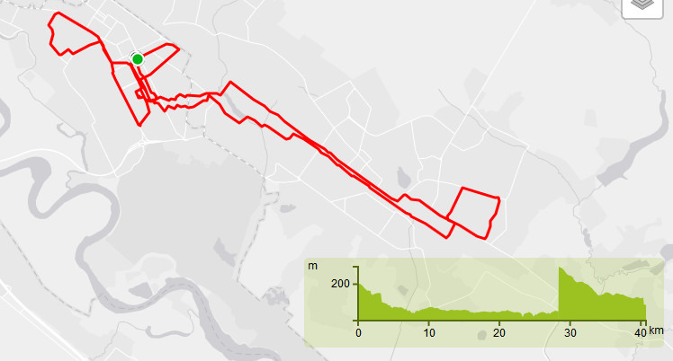
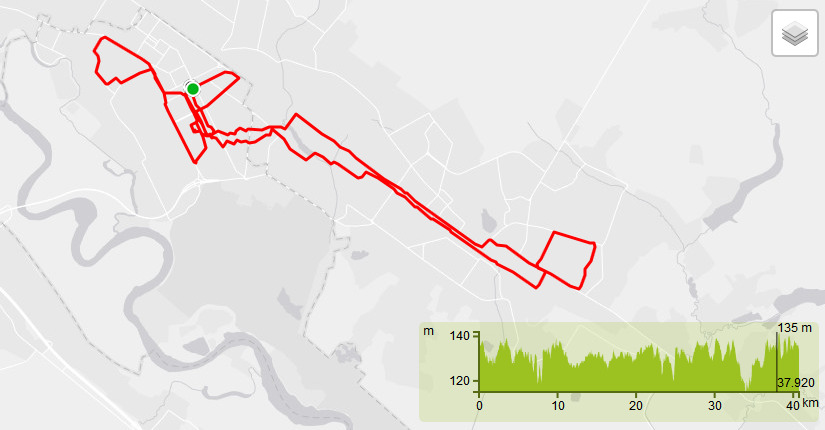
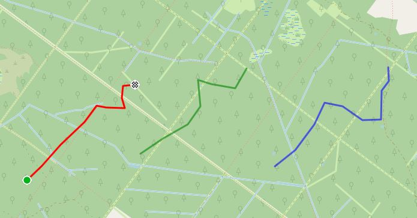
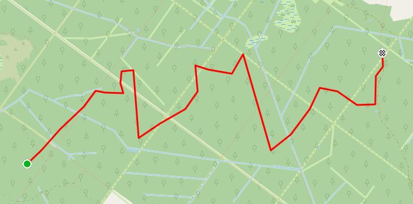
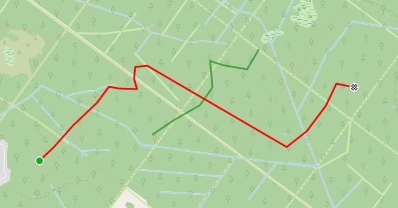
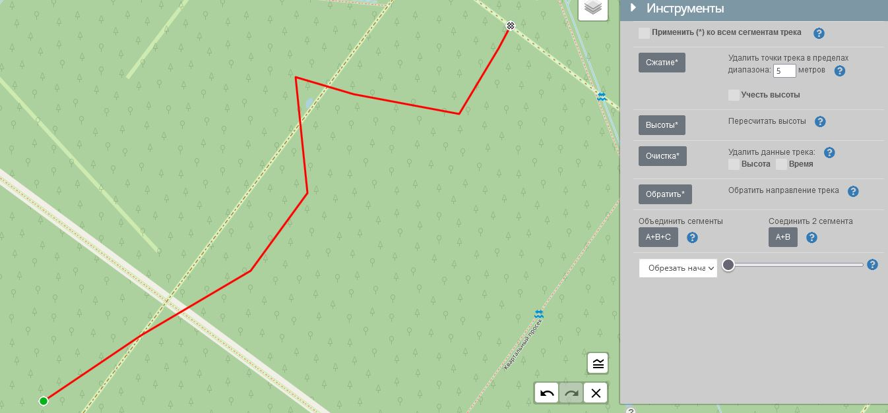
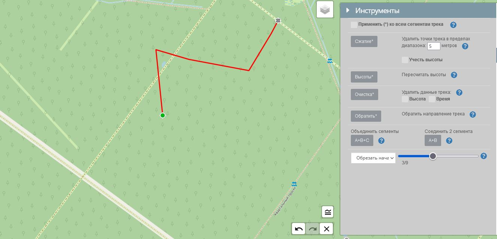

Для открытия панели инструментов перейдите в :fas fa-wrench: `Инструменты`:

##### Применить (*) ко всем сегментам трека

Если выбрано, то действия инструментов будут применены ко всем сегментам трека, а не только к активному (выбранному).

### Сжатие

Уменьшает размер файла без значительного изменения формы трека.
> Результат сжатия (компрессии):
>
> - Уменьшается потребление памяти памяти устройства и обработки трека браузером, что приводит к более быстрому выполнению редактора.
> - Упрощается пошаговое редактирование треков, т.к. сохраняются только наиболее важные точки.

Этот инструмент проверяет каждую точку трека и измеряет расстояние от линии между предыдущей и следующей точками. Если это расстояние меньше настраиваемого значения (по умолчанию 5 метров), точка удаляется.  
Если установлено `учесть высоты`, то точки имеющие большую разницу высот, но находящиеся ближе чем указанный диапазон, не будут удалены. (Полезно для треков на сильно пересеченной местности, например в горах).

### Высоты

В случае ошибочных данных в треке или объединения разных треков/сегментов, а также в случае отсутствия значения высот у точек трека возникает необходимость пересчитать высоты точек трека, для этого предназначен данный инструмент.

> Возможности:
>  
> - Пересчитывает все высоты точек сегмента(ов).  
> - По умолчанию используется встроенный сервер высот.
> - Можно использовать внешний веб-сервис для получения высот.

для использования внешнего сервиса получения высот, необходимо указать [API-ключ](/api-keys.md??id=Добавление-ключей) для этого сервиса и включить его использование: чекбокс(флажок) у этого ключа должен быть включен, чтобы редактор использовал его. Если включено несколько вариантов, используется первый по списку.

Пример исправления высот:

|до |после|
|:---:|:---:|
|||

### Очистка

Данный инструмент позволяет удалить данные о `высоте` и/или `времени`, записанные GPS, для каждой точки выбранного сегмента(ов).

### Обратить

Инвертирует все точки трека, так что начальная точка трека становится финишной, а конечная - началом трека.

### Cегменты

- ##### Объединить сегменты:   `A+B+C`
  Конечные точки сегментов будут соединены с начальными точками **следующего** сегмента.
  
  |до |после|
  |:---:|:---:|
  |||

  >[!NOTE]
  > Порядок соединения сегментов соответствует порядку их следования, который можно увидеть в [легенде сегментов](main-config?id=Отображать-Легенду).

- ##### Соединить 2 сегмента  `A+B`  
  Позволяет соединить два выбранных сегмента.  
  После нажатия на кнопку, необходимо выбрать первый сегмент на карте и после этого второй, которые хотите объединить.
  Результат: конечная точка первого сегмента будет соединена с начальной точкой второго.

  *Пример: соединены сегмент №1 и сегмент №3*
  |до |после|
  |:---:|:---:|
  |||  

>[!TIP]
>Если Вам необходима обратная функция - разделить трек на сегменты, смотрите раздел Треки-Сегменты-[Фрагменты](../tracks/track-segments.md)

### Обрезка

Позволяет образать активный сегмент трека.

> Варианты:
>
> - обрезать от начала сегмента (по умолчанию);
> - обрезать от конца сегмента.

Переместите ползунок, чтобы удалить точки с начала или конца трека.  
Общее количество точек `ZZZ` и удаляемое `XX` будет отображено под ползунком: (XX/ZZZ)

*Пример: обрезано 3 точки из 9 от начала сегмента*

|до |после|
|:---:|:---:|
|||  

>[!WARNING]
>*Полностью удалить точки не получится.  
>Всегда остаются 2 точки: стартовая и финишная.*
