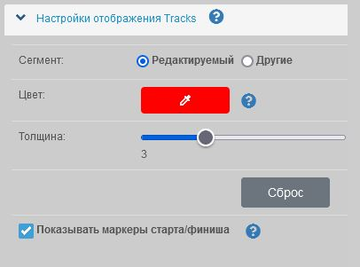

В меню **Настройки** раздел **Настройки отображения треков** можно установить цвет и толщину линии трека.

> Доступно 2 режима:
>  
> - Настройка линии редактируемого трека, т.е. активного (выбранного для редактирования);
> - Настройка прочих линий, т.е. сегментов и участков, не активных при редактировании.

?> Цвет *активного* (редактируемого) сегмента **всегда** соответствует выбранному в этих настройках.

?> Цвет *других* сегментов устанавливается "по умолчанию" как указано в этих настройках.

Выбрать *пользовательский* цвет сегментов, можно в легенде (списке) "Сегментов":
Этот цвет будет использоваться при сохранении трека.

Как включить отображение легенды: [Отображать-Легенду](../main-config.md?id=Отображать-Легенду)