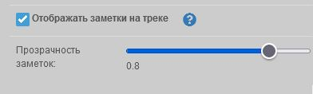

В меню  :fas fa-cog:`Настройки`:fas fa-chevron-right:`Настройки отображения треков` можно установить цвет и толщину линии трека.

> Доступно 2 режима:
>  
> - настройка линии редактируемого трека, т.е. активного (выбранного для редактирования)
> - настройка прочих линий, т.е. сегментов и участков, не активных при редактировании

?> Цвет `активного` (редактируемого) сегмента **всегда** соответствует выбранному в этих настройках.  
  Цвет `других` сегментов устанавливается "по умолчанию" как указано в этих настройках.

###### Настройки заметок к треку

> Доступно:
>  
> - отключение показа заметок на треке;
> - настройка прозрачности заметок.

Подробнее о возможности использования заметок/комментариев к точкам трека см. в разделе  [Заметки к треку](../tracks/track-note.md)

------

###### Пользовательский цвет сегментов
Можно выбрать в легенде(списке) "Сегментов"  
Этот цвет будет использоваться для сегмента при сохранении трека.  

Для установки пользовательского цвета сегментов необходимо включить отображение легенды: [Отображать-Легенду](../main-config.md?id=Отображать-Легенду)

