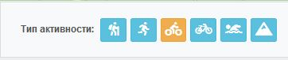
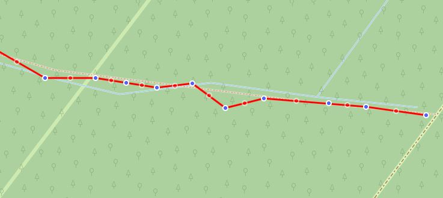
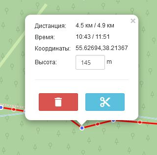
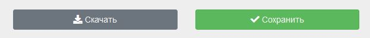
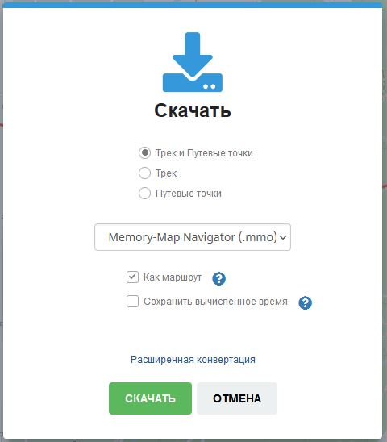

### Редактирование трека

- выберите тип активности для трека, это необходимо для правильного рассчета статистики, отображаемой внизу карты,  
а также для выбора режима [маршрутизации](../tools/routing.md) (типа дорог), если Вы его будете использовать.

  

- перейдите в режим `редактирования трека` (F2):

  

- кликайте на карте в том месте, где хотите установить новую точку трека ( трек рисуется от последней точки )
- перемещайте точки трека (синие), если необходимо скорректировать их расположение
- если необходимо добавить новую точку посередине трека, кликните на красной точке или переместите её. Красных точек нет в треке, они отображены лишь для редактирования, посередине, между существующими (синие)  
  

- нажав на точку трека можно получить актуальную информацию об этой точке, а также удалить её или разделить трек в этой точке на сегменты  
    

- для удаления группы точек, воспользуйтесь инструментом выделения и [удаления](/track-segments?id=Удаление-точек) точек

- для окончания редактирования перейдите в режим `просмотра` (F1):
  
  

-----

### Cохранение трека

Проверьте корректность установленной активности для сохраняемого трека:

> Доступные варианты сохранения:  
> 

1. **сохранить в хранилище на gpsies.ru** (только для зарегистрированных пользователей)  
  Горячие клавиши: `Shift+S`

  >[!NOTE]
  >После сохранения трека на сервере Вам будут доступны широкие возможности по добавлению/получению информации о треке, возможность выбирать категории, добавлять фотографии, объединять треки в группы, устанавливать приватность, делиться в виде виджетов и многое другое.  
  >Подробнее в разделе [Хранилище треков](../storage.md)
  
1. **скачать на устройство:**  
   Горячие клавиши: `Shift+S`  
   - если Вы еще не указали название трека, Вам будет предложено добавить название и описание(опционально)
   - скачивание будет производиться через [конвертер](../tools/converter.md) треков 

    

    в открывшемся окне можно выбрать необходимый для скачивания формат и содержимое трека:

    > - трек и путевые точки
    > - только трек
    > - только путевые точки (маркеры)

   - Дополнительные опции:
     - ***Скачать как маршрут***  - если выбрано и выходной формат может быть преобразован в маршрут (см. [таблицу форматов](../tools/converter.md)), то вместо трека, выходной файл будет содержать маршрут. *Пример: для формата GPX будет использован формат GPX-Route.*
     - ***Сохранять вычисленное время*** - добавит в трек время, вычисленное редактором и отображенное под картой в таблице статистики.

      >[!WARNING]
      >добавление вычисленного времени из редактора отменит любое потенциальное время, которое Вы, возможно, ранее записали для этого трека.

-----

>[!TIP]
>Если установлено  [сохранение](../main-config.md?id=Сохранение-настроек) в Локальном хранилище, Ваш трек будет сохранен в нём в последнем состоянии.  
>Даже в случае случайного закрытия браузера, Вы сможете продолжить редактирование при последущем входе в редактор.
