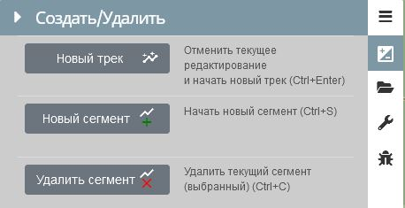
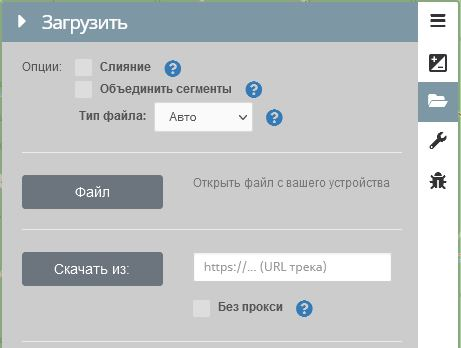

<!-- markdownlint-disable-next-line first-line-heading -->
----

### Создание нового трека

1. Автоматически

   - при первом посещении новый трек (пустой) будет создан автоматически;
   - при повторном посещении в этом же браузере, если установлено (по-умолчанию) сохранение данных в [локальном хранилище](), будет предложено либо открыть трек из последний сессии, либо начать новый.

1. Создать новый трек или сегмент трека можно из меню:

    

    Горячие клавиши: `Ctrl+Enter` - отменить текущее редактирование и создать новый трек. `Ctrl+S` - добавить новый сегмент в текущий трек (текущий сегмент должен содержать хотябы 2 точки), `Ctrl+C` - удалить активный сегмент.

-----

### Загрузка трека

#### Опции загрузки

- ***Слияние:*** Текущий отредактированный трек не будет удален, он будет дополнен загруженным.
- ***Объединить сегменты:*** Если загружаемый трек содержит несколько сегментов, они будут автоматически объединены.
- ***Тип файла:*** `Авто`, `GPX`, `KML`, `Geojson` - в большинстве случаев подходит «Авто», тип файла выбирается в зависимости от расширения файла.

#### Загрузка с устройства

Откроется окно выбора файла на Вашем устройстве

#### Скачать из

Введите ссылку на расположение файла в сети.

>[!WARNING]
> Ссылка обязательно должна иметь протокол `https`

***Без прокси*** - Загрузка без прохождения через CORS-прокси. Проверьте, принимает ли целевой сервер запросы из разных источников и хотите ли вы использовать сеанс браузера для получения файла.

>[!NOTE]
>Cross-origin resource sharing (CORS; с англ. — «совместное использование ресурсов между разными источниками») — технология современных браузеров, которая позволяет предоставить веб-страницам доступ к ресурсам другого домена.

>[!TIP]
>Если Вы не понимаете назначение этого пункта, просто проигнорируйте его
