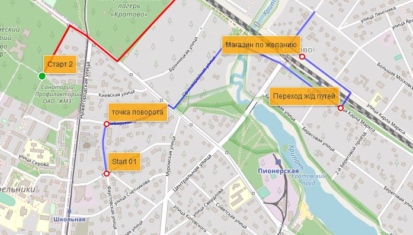
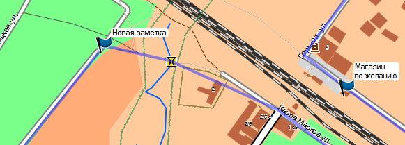
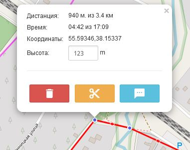
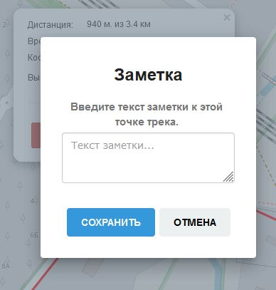
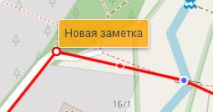

<!-- markdownlint-disable-next-line first-line-heading -->
### Общая информация

**Заметки** к точкам трека - это комментарии, которые могут быть использованы для подсказок, информации при навигации по треку.  
Например, в них можно указать "свернуть на тропу за большим деревом", "проход только с 8 до 20" и т.п.  

Их основное отличие от обычных маркеров в том, что маркеры обычно используются для обозначения POI (point of interest) - точек интереса, т.е. для **объектов**, например гостиницы, магазина, родника и т.п., а заметки предназначены для подсказок при движении по треку. Некоторые навигационные приборы могут показывать приближение к данной точке, что позволит заранее знать информацию о предстоящем пути.

Т.к. комментарии к точкам трека поддерживаются не для всех форматов, а также могут игнорироваться некоторыми навигационными приборами, при скачивании или сохранении трека, заметки будут **продублированы** маркерами со значками по умолчанию, что позволит им отражаться на большинстве устройств.

Пример отображения в программе "BaseCamp" (для большинства устройств Garmin):  

### Добавление и редактирование

Для добавления или редактирования заметки, нажмите на точку редактируемого трека:

В баллоне точки нажмите textsms  
После этого в открывшемся окне можно добавить или изменить заметку:

Для удаления заметки, очистите текстовое поле и сохраните данные.

Точка, к которой есть заметка будет отображаться на треке специальным маркером:

При удалении точки из трека, заметка также будет удалена.

### Отображение заметок

Вы можете отключить показ заметок над точками трека или установить их прозрачность, подробнее см. в [Настройки трека](../tracks/track-config.md?id=Настройки-заметок-к-треку)