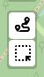
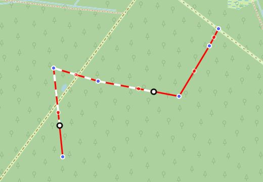
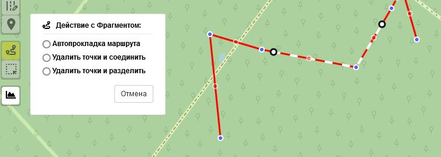
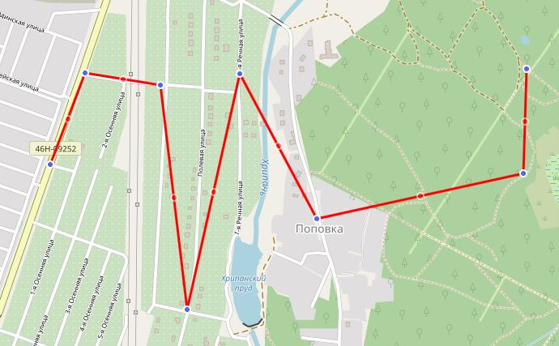
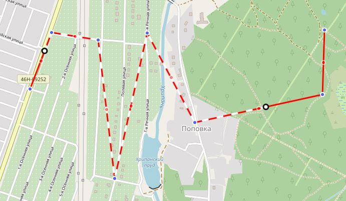
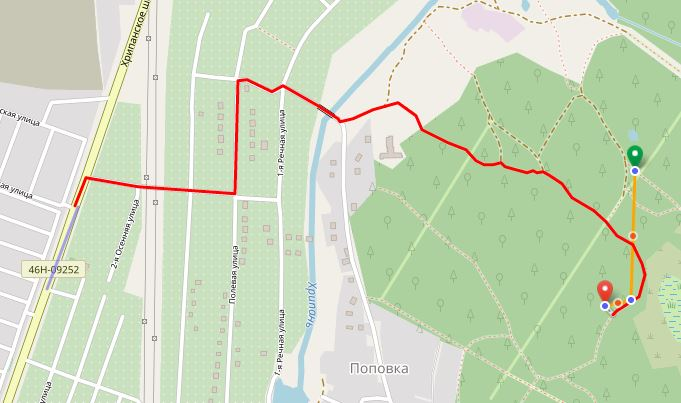
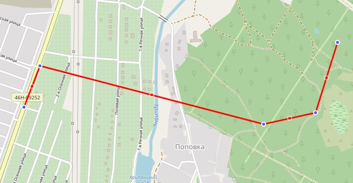
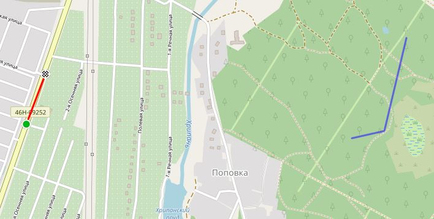
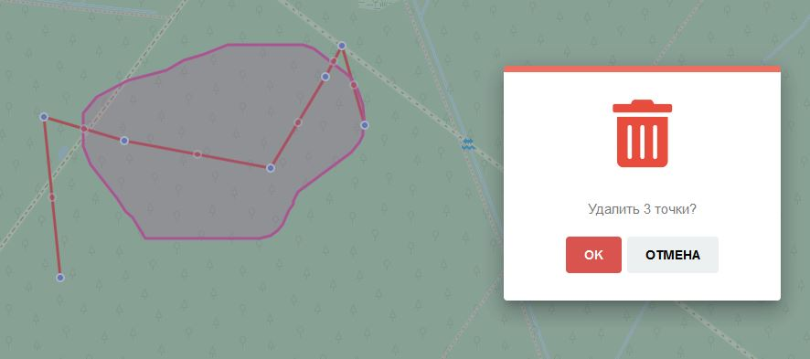
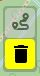

<!-- markdownlint-disable-next-line first-line-heading -->
**Фрагменты** - выделенные участки  треков/сегментов для проведения действий над ними.

Для обработки "фрагментов" используйте блок кнопок в левой части карты:

-----

### Действия с Фрагментом

1. **Активируйте режим работы с фрагментами**

   нажмите на кнопку :fa fa-route fa-lg:

1. **Выделите фрагмент(участок) на активном сегменте для выбора действия с ним:**

   - первое нажатие на линии сегмента - начальная точка фрагмента,
   - второе нажатие - конечная точка фрагмента.
   - точки можно перемещать вдоль линии для изменения выделенного фрагмента
  
  Выделенный фрагмент будет отображен пунктиром на линии трека/сегмента:

  

1. **Выберите действие, которое хотите произвести с выделенным фрагментом:**
  
   

   - ***Автопрокладка маршрута***  
     Между начальной и конечной точкой фрагмента будет автоматически проложен маршрут в соответствии с установленным сервисом маршрутизации

     |исходный сегмент|выделенный участок|результат
     |:---:|:---:|:---:|
     |||

     >[!NOTE]
     > Маршрутизация в большинстве случаев зависит от выбранного типа активности `пешком`, `велосипед` и т.п.  
     > Подробнее о настройках см. [Маршрутизация](/tools/routing.md)

   - ***Удалить точки и соединить***  
     Все точки внутри фрагмента будут удалены, а начальная и конечная точка фрагмента соединены прямой линией

     |исходный сегмент|выделенный участок|результат
     |:---:|:---:|:---:|
     |||

   - ***Удалить точки и разделить***  
     Все точки внутри фрагмента будут удалены, а выбранный сегмент будет разделен на два отдельных

     |исходный сегмент|выделенный участок|результат
     |:---:|:---:|:---:|
     |||

-----

### Удаление точек

Выбрав это действие, необходимо выделить участок, обведя необходимые для удаления точки мышью и подтвердить удаление:

Повторное нажатие на кнопку :fa fa-trash: отменит режим выделения:  

>[!TIP]
> Начав выделение не отпускайте кнопку мыши до тех пор, пока не выделите нужную облать для удаления.  
Отпустив кнопку, начальная и конечная точка линии ограничивающей участок для удаления, соединятся.
